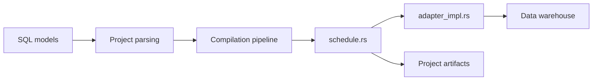

# dbt-labs/dbt-core

> Transforme des données en entrepôt par des requêtes SELECT versionnées et testées ; la branche main est la v2 en Rust.

## Le problème
Les transformations SQL sans versionnage, tests ni graphe de dépendances deviennent ingérables.

## Ce que ça fait vraiment
Les modèles SQL sont analysés, compilés, ordonnancés et exécutés dans l'entrepôt, avec tests et lignage. La v2 est une réécriture en Rust : binaire unique, plus rapide, spécification stricte, artefacts Parquet en plus du JSON, documentation locale rénovée. La v1 Python vit sur `1.latest`.

## Comment c'est branché


## Essayer
```bash
# Aucune commande documentée dans ce README :
# renvoie vers la page d'installation de dbt.
```

## Coût et pièges
Gratuit côté code Apache-2.0. La distribution dbt est sous licence produit dbt. Un entrepôt est nécessaire. Attention à la branche : la v1 est sur `1.latest`.

## Ce que ce n'est pas
Ce n'est pas un outil d'extraction ni de chargement : il transforme ce qui est déjà dans l'entrepôt. La v2 est annoncée comme réécriture totale.

## Alternatives
Non documenté : le README ne nomme pas d'alternative.

## Pour toi
Adopter pour toute chaîne d'analytique : standard de la transformation SQL ; vérifie si tu vises la v1 ou la v2.

