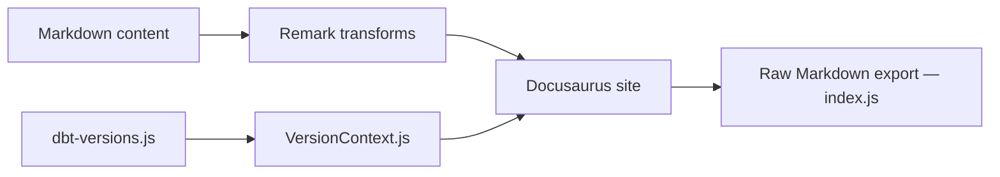

# dbt-labs/docs.getdbt.com

> Source Docusaurus de la documentation officielle de dbt, pour contribuer ou la faire tourner en local.

## Le problème
Corriger ou enrichir la documentation de dbt demande de savoir où elle vit et comment la prévisualiser.

## Ce que ça fait vraiment
Le dépôt contient le site Docusaurus en Markdown (parfois HTML) avec versions multiples de dbt, contenu partagé entre pages, onglets, guides de démarrage, blog et retours de page. Des plugins convertissent le contenu en Markdown brut pour les LLM. Quatre skills Claude Code automatisent le triage des issues, la création de pages et les badges de disponibilité.

## Comment c'est branché


## Essayer
```bash
git clone https://github.com/dbt-labs/docs.getdbt.com.git
cd docs.getdbt.com
cd website
npm install
npm start
npm run build
```

## Coût et pièges
Gratuit. Sur Mac, `npm install` peut exiger `brew install vips`, long. Toute PR passe en relecture éditoriale et technique. 228 issues ouvertes.

## Ce que ce n'est pas
Pas le code de dbt lui-même ni un outil à utiliser : c'est le contenu d'un site de documentation.

## Alternatives
Aucune alternative nommée dans le README.

## Pour toi
À surveiller : utile si tu veux corriger la doc dbt ou copier les skills Claude Code du dépôt, sans autre valeur directe.

