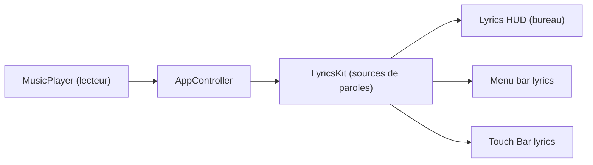

# ddddxxx/LyricsX

> Application macOS qui affiche les paroles synchronisées de la musique en cours dans un lecteur.

## Le problème
Suivre les paroles d'un morceau sans ouvrir une page web à côté du lecteur.

## Ce que ça fait vraiment
Se branche sur des lecteurs de musique, recherche et télécharge des paroles chronométrées depuis des sources en ligne, les affiche sur le bureau, la barre de menus et la Touch Bar. Décalage réglable, saut par double clic, import/export par glisser-déposer, format LRCX (compatible LRC), conversion chinois traditionnel/simplifié. Versions iOS et Linux « en début de développement ».

## Comment c'est branché


## Essayer
```bash
brew install --cask lyricsx
```

## Coût et pièges
Gratuit. macOS 10.11 minimum. Les paroles appartiennent à leurs détenteurs de droits (avertissement du README).

## Ce que ce n'est pas
Pas un lecteur de musique ni un éditeur LRCX : aucun éditeur officiel n'existe.

## Alternatives
Aucune alternative nommée dans le README.

## Pour toi
À ignorer : application grand public macOS sans lien avec la donnée, l'IA ou le MLOps.

