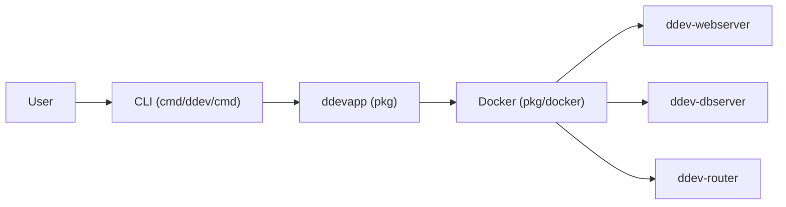

# ddev/ddev

> Environnements de développement locaux sous Docker pour projets PHP et Node.js, partageables par équipe.

## Le problème
Configurer serveur web, base de données et PHP à la main pour chaque projet est long, et diffère d'un poste à l'autre.

## Ce que ça fait vraiment
`ddev start` lance les conteneurs d'un projet dont la configuration (versions de PHP 5.6 à 8.5, Nginx ou Apache, MariaDB, MySQL ou PostgreSQL) est versionnée avec le code. D'après le code, la CLI (`cmd/ddev/cmd`) s'appuie sur `pkg/ddevapp` et sur quatre conteneurs : `ddev-webserver`, `ddev-dbserver`, `ddev-router`, `ddev-ssh-agent`. Il apporte HTTPS local, Xdebug, instantanés de base et intégrations d'hébergeurs (Upsun, Pantheon, Acquia).

## Comment c'est branché


## Essayer
```bash
ddev start
ddev import-db
ddev snapshot
ddev exec
ddev share
ddev list
```
L'installation passe par le guide en ligne (choix du système), non reproduit dans le README.

## Coût et pièges
Gratuit ; un moteur Docker est requis, et macOS, Windows 11, WSL2, Linux et Codespaces sont pris en charge. `ddev share` publie une URL publique temporaire de ton site local : attention aux données réelles.

## Ce que ce n'est pas
Ce n'est pas un environnement Python ou data : il cible les CMS et frameworks PHP et Node. La composante graphe du dépôt est illisible pour cette fiche (aucun composant lisible), l'architecture ci-dessus vient de la description du code.

## Alternatives
Aucune alternative nommée dans le README.

## Pour toi
À ignorer : très bien pour des projets PHP et CMS (fondation à but non lucratif, actif en septembre 2026), mais hors de ton périmètre data, IA et MLOps.
