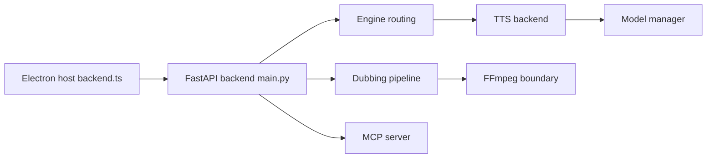

# debpalash/VoiceStudio

> Studio vocal de bureau local : clonage, TTS, doublage vidéo, livres audio, avec API et MCP.

## Le problème
Cloner une voix ou doubler une vidéo passe souvent par des services cloud payants qui gardent vos enregistrements.

## Ce que ça fait vraiment
Appli Electron + backend FastAPI (`backend/main.py`, port 3900) orchestrant plusieurs moteurs TTS (OmniVoice par défaut, CosyVoice, IndexTTS…).
Pipeline de doublage : ASR, diarisation, traduction, synthèse calée, contrôle qualité, export via FFmpeg.
Rendu long format (livres audio), dictée, file de jobs SQLite, bus d'événements.
API compatible OpenAI, serveur MCP, workers GPU distants optionnels.

## Comment c'est branché


## Essayer
```bash
git clone https://github.com/debpalash/VoiceStudio.git
cd VoiceStudio
bun install
bun run setup:api
bun run dev
```

## Coût et pièges
Besoins matériels variables selon le moteur ; modèles à télécharger (taille et licence propres). Analytics sur consentement. Migration Tauri → Electron récente.

## Ce que ce n'est pas
Pas un modèle TTS en soi : un orchestrateur de moteurs tiers. Projet jeune (avril 2026) porté par un particulier.

## Alternatives
Aucune alternative nommée dans le README (k2-fsa/OmniVoice est le moteur par défaut, pas un concurrent).

## Pour toi
Intéressant pour l'API locale compatible OpenAI et MCP ; à suivre avant de s'y fier.
