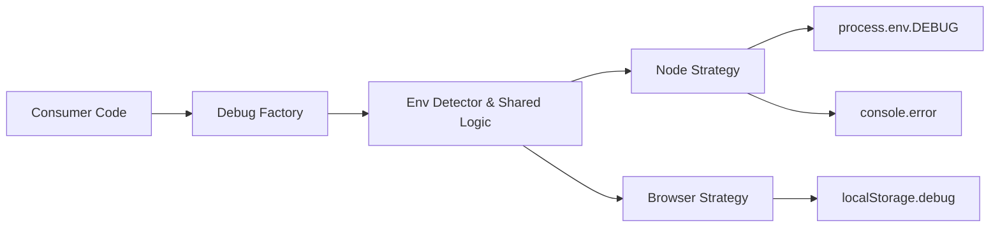

# debug-js/debug

> Petit utilitaire JavaScript de logs de débogage par espace de noms, pour Node.js et navigateurs.

## Le problème
Les `console.log` de débogage s'accumulent et ne peuvent pas être activés ou coupés finement par module.

## Ce que ça fait vraiment
`require('debug')('http')` renvoie une fonction de log liée à un espace de noms, activée via la variable `DEBUG` (jokers `*`, exclusions `-`).
Couleur par espace de noms, écart en millisecondes entre appels, horodatage ISO hors TTY.
Formateurs printf (`%o`, `%O`, `%j`…) extensibles, sortie redirigeable, `extend()`, `enable()`/`disable()` dynamiques.
Dans le navigateur, configuration via `localStorage.debug`.

## Comment c'est branché


## Essayer
```bash
npm install debug
```

## Coût et pièges
Gratuit, MIT ; sans `supports-color`, palette de couleurs réduite ; couleurs absentes en processus enfant sans `DEBUG_COLORS=1`.

## Ce que ce n'est pas
Pas un système de logging de production (niveaux, transports, agrégation).
Rien pour Python.

## Alternatives
Aucune alternative nommée dans le README.

## Pour toi
À ignorer : dépendance JavaScript omniprésente mais hors de ta stack Python ; à connaître seulement pour lire les logs d'outils Node.
