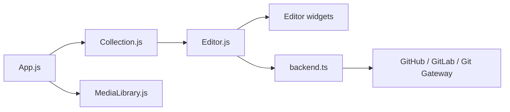

# decaporg/decap-cms

> CMS dans le navigateur pour éditer le contenu d'un site statique stocké dans Git.

## Le problème
Les non-développeurs ne veulent pas éditer des fichiers Markdown dans Git pour mettre à jour un site statique.

## Ce que ça fait vraiment
Application monopage montée sur `/admin` du site. Un fichier YAML décrit le modèle de contenu ; après connexion, l'utilisateur crée ou modifie des entrées via un éditeur à widgets, une bibliothèque de médias et un workflow éditorial optionnel. Les sauvegardes passent par un backend Git (GitHub, GitLab, Git Gateway, autres). Ancien Netlify CMS, renommé en 2023.

## Comment c'est branché


## Essayer
```bash
# Aucune commande exacte dans le README : installation rapide
# via un fichier HTML + une config chargés depuis un CDN (voir le Quick Start Guide).
```

## Coût et pièges
Gratuit ; un service d'authentification et un dépôt Git hébergé sont nécessaires. Offre commerciale annexe (Decap Turbo, services d'experts). 593 issues ouvertes.

## Ce que ce n'est pas
Pas un CMS avec base de données : le contenu reste des fichiers dans Git.

## Alternatives
Aucune alternative nommée dans le README.

## Pour toi
Peu lié à la data/IA ; utile si tu publies un site de docs ou un blog statique à plusieurs, sinon passe.

