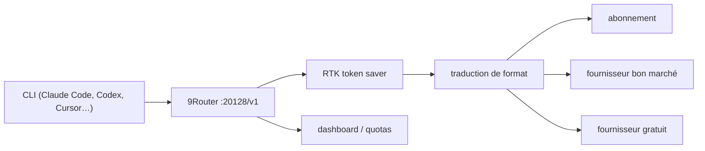

# decolua/9router

> Proxy local qui route les outils de code vers 40+ fournisseurs de LLM avec repli automatique.

## Le problème
Un quota atteint en pleine session arrête le travail ; un quota non consommé est perdu à la fin du mois.
Les sorties d'outils (`git diff`, `grep`, `ls`) remplissent le prompt et coûtent cher en tokens d'entrée.

## Ce que ça fait vraiment
Expose un endpoint OpenAI local (`http://localhost:20128/v1`) et traduit entre formats OpenAI, Claude, Gemini, Cursor, Vertex, Ollama.
RTK compresse les `tool_result` avant envoi (filtres git-diff, grep, find, tree, dedup-log) ; annoncé à 20-40 % d'économie.
Repli en trois étages : abonnement → fournisseur bon marché → gratuit, avec suivi de quota et rafraîchissement OAuth.
Injecteurs de prompt optionnels (Caveman, Ponytail) pour raccourcir les sorties ; tableau de bord, logs, analytics, synchronisation cloud.

## Comment c'est branché


## Essayer
```bash
npm install -g 9router
9router
cp .env.example .env
npm install
PORT=20128 NEXT_PUBLIC_BASE_URL=http://localhost:20128 npm run dev
pip install "headroom-ai[proxy]"
headroom proxy --port 8787
```

## Coût et pièges
Le logiciel ne facture rien, mais les « coûts » du tableau de bord sont fictifs : seuls les fournisseurs facturent.
Les offres gratuites citées se réduisent : Kiro plafonné à ~50 crédits/mois, iFlow et Qwen Code arrêtés, Gemini CLI fermé.

## Ce que ce n'est pas
Ce n'est pas un accès illimité gratuit, malgré le titre : chaque étage gratuit a son plafond et change sans préavis.
Ce n'est pas auditable en l'état : le paquet du dépôt est privé (`9router-app`) et le README ne déclare pas de licence.
Ce n'est pas neutre pour tes données : tout ton trafic de code transite par un proxy, avec option de synchronisation cloud.
Le README fourni ici est tronqué après le début du guide de configuration.

## Alternatives
Headroom (`headroom-ai`) : proxy de compression de contexte, utilisable seul via `/v1/compress`.
OpenRouter : routage multi-fournisseurs, cité parmi les fournisseurs à clé d'API.

## Pour toi
À éviter en contexte professionnel : faire transiter du code client par un proxy tiers non licencié n'est pas défendable.
