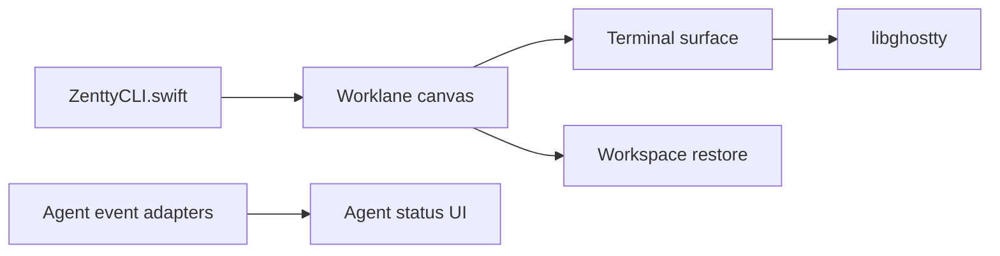

# dedene/zentty

> Terminal macOS natif, construit sur Ghostty, pour travailler avec plusieurs agents de code en parallèle.

## Le problème
Avec plusieurs agents dans des onglets de terminal, on ne voit pas lequel attend une validation ou travaille encore.

## Ce que ça fait vraiment
Terminal Swift/AppKit sur libghostty, avec « worklanes » (colonnes défilantes de panneaux), palette de commandes et restauration des sessions. La barre latérale et la barre de menus affichent l'état des agents (en cours, en attente, approbation), le nombre de sous-agents, les ports locaux et l'état des PR. Il détecte les lanceurs de tâches et colle des fichiers dans une session ssh. Une CLI `zentty` embarquée pilote le tout.

## Comment c'est branché


## Essayer
```bash
brew install --cask zentty
./scripts/build_ghosttykit.sh
xcodebuild -project Zentty.xcodeproj -scheme Zentty -destination 'platform=macOS' build
```

## Coût et pièges
Gratuit, macOS 14+. La compilation demande Xcode, `zig` et `gettext`. Projet en développement actif avec changements cassants possibles. GPL-3.0 ; la marque Zentty est protégée séparément.

## Ce que ce n'est pas
Pas un agent ni une intégration IDE : c'est un terminal. Uniquement macOS.

## Alternatives
Ghostty : le terminal sur lequel il est construit, sans gestion des agents.

## Pour toi
À surveiller : intéressant si tu travailles beaucoup avec des agents sur Mac, mais un changement de terminal est un choix personnel, et le projet bouge vite.

