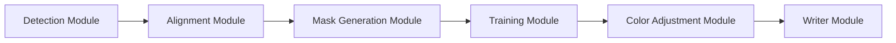

# deepfakes/faceswap

> Logiciel Python d'échange de visages par apprentissage profond, pour l'expérimentation et les effets visuels consentis.

## Le problème
Les techniques d'échange de visages restaient réservées aux spécialistes, faute de code assemblé et utilisable.

## Ce que ça fait vraiment
Trois étapes : extraire les visages de photos ou vidéos, entraîner un modèle sur deux jeux de visages, puis convertir les sources avec ce modèle. Interface en ligne de commande et interface graphique. Plusieurs architectures de modèles, des détecteurs, des aligneurs et des masques sont fournis sous forme de plugins.

## Comment c'est branché


## Essayer
```bash
python faceswap.py extract
python faceswap.py train
python faceswap.py convert
python faceswap.py gui
```

## Coût et pièges
Gratuit. Un GPU CUDA récent est recommandé (AMD via ROCm sous Linux). L'entraînement demande du temps et des données.

## Ce que ce n'est pas
Ce n'est pas un outil à utiliser sans le consentement des personnes concernées : le manifeste du README exclut les contenus inappropriés et le changement de visage sans consentement ou en cachant son usage. Le droit à l'image et la loi locale s'appliquent à l'utilisateur.

## Alternatives
Le README ne nomme pas d'alternative.

## Pour toi
À surveiller : utile pour apprendre l'entraînement de réseaux génératifs sur images, à condition de n'utiliser que des visages consentis et de vérifier la licence GPL-3.0 avant réutilisation.
