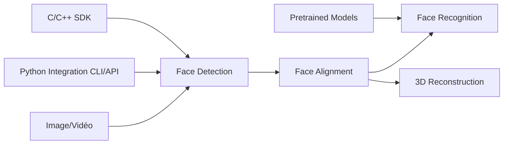

# deepinsight/insightface

> Boîte à outils d'analyse faciale 2D/3D (détection, alignement, reconnaissance) pour chercheurs et intégrateurs vision.

## Le problème
Construire une chaîne visage complète (trouver, aligner, identifier) suppose de réunir modèles, jeux de données, pertes et scripts d'évaluation épars.

## Ce que ça fait vraiment
Implémente ArcFace, PartialFC, SubCenter ArcFace (reconnaissance), RetinaFace et SCRFD (détection), SDUNets (alignement).
Fournit un paquet Python, un SDK C/C++ (InspireFace), un model zoo et des pipelines d'évaluation IJB/Megaface.
La v2.0 ajoute PrivateFrame (floutage vidéo local), une détection de vivacité optionnelle et InsightFace Server (Web UI, API REST, SQLite, ONNX Runtime).
Maintenu principalement par deux personnes (Jia Guo, Jiankang Deng).

## Comment c'est branché

## Essayer
Aucune commande documentée dans le README (renvoi au python-package et au site).

## Coût et pièges
GPU nécessaire pour l'entraînement ; MXNet 1.6-1.8 et PyTorch 1.6+ coexistent. Aucune licence déclarée au niveau du dépôt : l'usage commercial des modèles est à clarifier.

## Ce que ce n'est pas
Pas une API prête à l'emploi unique : c'est un ensemble de sous-projets hétérogènes. La reconnaissance faciale soulève des contraintes légales (RGPD) non traitées ici.

## Alternatives
- InsightFace_Pytorch : réimplémentation PyTorch pure d'ArcFace.
- InsightFace-REST : déploiement TensorRT en service REST.
- wang-xinyu/tensorrtx : inférence TensorRT optimisée.

## Pour toi
Surveiller : référence technique incontournable en reconnaissance faciale, mais l'absence de licence déclarée bloque tout usage produit tant qu'elle n'est pas vérifiée.
