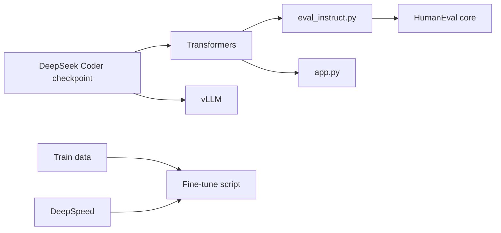

# deepseek-ai/DeepSeek-Coder

> Outillage d'évaluation, fine-tuning et démo autour des modèles de code DeepSeek Coder (1B à 33B).

## Le problème
Évaluer et adapter un LLM de code ouvert sur ses propres tâches demande harness de benchmarks et scripts de fine-tuning fiables.

## Ce que ça fait vraiment
Modèles entraînés sur 2T tokens (87 % code), fenêtre 16K, tâche fill-in-the-middle pour complétion au niveau dépôt.
`Evaluation/` : HumanEval, MBPP, LeetCode, DS-1000, PAL-Math, avec exécution des solutions générées.
`finetune/finetune_deepseekcoder.py` : fine-tuning DeepSpeed ZeRO-3 sur données `instruction`/`output`.
Exemples d'inférence Transformers et vLLM ; démo locale `demo/app.py`.

## Comment c'est branché


## Essayer
```bash
pip install -r requirements.txt
pip install -r finetune/requirements.txt
```

## Coût et pièges
Gratuit ; GPU requis (bf16, `.cuda()`). `trust_remote_code=True` dans tous les exemples. Licence modèle distincte de la licence du code.

## Ce que ce n'est pas
Pas le code de pré-entraînement. Modèles de 2023, dépassés par les générations suivantes.

## Alternatives
- awesome-deepseek-coder : liste de projets liés, pas un remplaçant.

## Pour toi
Surveiller : le harness d'évaluation et le script de fine-tuning restent réutilisables, mais les modèles eux-mêmes ont vieilli.
