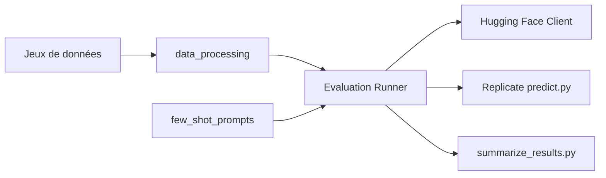

# deepseek-ai/DeepSeek-Math

> Modèles de 7 milliards de paramètres spécialisés en mathématiques, avec code d'évaluation, pour la recherche.

## Le problème
Les modèles ouverts généralistes raisonnent mal sur les problèmes de niveau compétition, et les données mathématiques du web sont dispersées.

## Ce que ça fait vraiment
Trois modèles (Base, Instruct, RL) partent de DeepSeek-Coder-v1.5 7B, avec 500 milliards de jetons de pré-entraînement ; le RL utilise GRPO. Le corpus math vient de Common Crawl (35,5 millions de pages, 120 milliards de jetons) par sélection itérative avec fastText. Les poids sont sur Hugging Face ; le dépôt fournit des scripts d'inférence et d'évaluation (chaîne de pensée, PAL, outils intégrés), le tout piloté par des configurations JSON.

## Comment c'est branché


## Essayer
```bash
pip install torch transformers
```
```python
from transformers import AutoTokenizer, AutoModelForCausalLM
model_name = "deepseek-ai/deepseek-math-7b-instruct"
tokenizer = AutoTokenizer.from_pretrained(model_name)
model = AutoModelForCausalLM.from_pretrained(model_name, device_map="auto")
```

## Coût et pièges
Un GPU capable de charger un 7B en bfloat16. Il faut la consigne de raisonnement pas à pas avec `\boxed{}`, et éviter le prompt système. La longueur de séquence est de 4096.

## Ce que ce n'est pas
Pas un dépôt suivi : dernier push en avril 2024. Le README renvoie à une section « License » absente du texte fourni (la numérotation saute de 5 à 8) : les conditions d'usage des poids ne s'y lisent pas, alors que le code est en MIT.

## Alternatives
Aucune alternative n'est citée dans le README.

## Pour toi
À ignorer pour de la production : figé depuis 2024 ; garde-le pour lire la méthode (corpus itératif, GRPO) et reproduire les évaluations.
