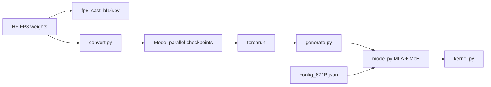

# deepseek-ai/DeepSeek-V3

> Poids et code d'inférence de démonstration du modèle MoE DeepSeek-V3 (671 Md de paramètres, 37 Md actifs).

## Le problème
Étudier ou faire tourner soi-même un grand modèle ouvert suppose d'avoir ses poids, sa configuration et un code d'inférence qui les charge.

## Ce que ça fait vraiment
Le README décrit le modèle : attention MLA, routage DeepSeekMoE sans perte auxiliaire, objectif de prédiction multi-token, entraînement FP8, contexte 128K, poids sur Hugging Face (685 Go avec le module MTP).
Le code se limite à une démo d'inférence : `convert.py` découpe les poids FP8 Hugging Face en shards model-parallel, `fp8_cast_bf16.py` produit du BF16, puis `generate.py` lancé par `torchrun` fait la génération interactive ou par lot. `model.py` porte le graphe, `kernel.py` les noyaux Triton. Aucune API de service.

## Comment c'est branché

## Essayer
Aucune commande dans la partie lue du README : la section 6 « How to Run Locally » est tronquée.

## Coût et pièges
Poids gratuits, mais 671 Md de paramètres : plusieurs nœuds multi-GPU, avec des shards alignés sur le degré de parallélisme. Les poids suivent un « Model Agreement » distinct de la licence MIT du code.

## Ce que ce n'est pas
Pas un serveur d'inférence : pas d'API ni d'ordonnanceur. Pas le code d'entraînement. La prise en charge MTP est « en développement » côté communauté.

## Alternatives
Aucune alternative nommée dans le README (Qwen2.5 72B et LLaMA3.1 405B n'y apparaissent que dans les tableaux de benchmarks).

## Pour toi
À ignorer comme dépôt : trop lourd à faire tourner soi-même, et figé depuis août 2025.
