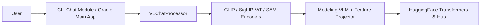

# deepseek-ai/DeepSeek-VL

> Famille de modèles vision-langage ouverts (1,3 et 7 milliards de paramètres) pour comprendre images, schémas et documents.

## Le problème
Interroger une image en langage naturel (schéma, page web, formule, document scientifique) demande un modèle multimodal et le code pour le charger.

## Ce que ça fait vraiment
Quatre points de contrôle sont publiés (1,3B et 7B, base et chat, séquence 4096) sur Hugging Face. Le dépôt fournit un paquet `deepseek_vl` : un processeur de conversations (`VLChatProcessor`), trois encodeurs visuels (CLIP, SigLIP-ViT, SAM), un projecteur et le modèle de langage. Deux interfaces : un chat en ligne de commande et une démo Gradio.

## Comment c'est branché


## Essayer
```bash
pip install -e .
python cli_chat.py --model_path "deepseek-ai/deepseek-vl-7b-chat"
pip install -e .[gradio]
python deepseek_vl/serve/app_deepseek.py
```

## Coût et pièges
Gratuit, mais l'exemple charge le modèle en bfloat16 sur GPU (`.cuda()`), avec `trust_remote_code=True`. Le README dit que l'usage commercial est permis sous les conditions de la section Licence, absente de l'extrait lu : lire ces conditions pour les poids.

## Ce que ce n'est pas
Ce n'est pas un modèle récent : le dépôt est figé depuis avril 2024 (dernier push le 24 avril 2024) et le README ne mentionne aucune évolution. Ce n'est pas non plus une bibliothèque d'inférence optimisée : l'exemple est un script `transformers` de base.

## Alternatives
Aucune alternative citée dans le README.

## Pour toi
À ignorer pour un projet neuf : dépôt gelé depuis 2024 et exemple GPU, à consulter seulement pour l'assemblage encodeurs + projecteur.
