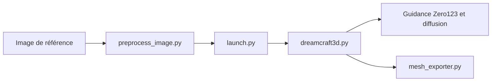

# deepseek-ai/DreamCraft3D

> Implémentation officielle d'un article générant un objet 3D texturé à partir d'une image et d'un texte.

## Le problème
Les méthodes de génération 3D par distillation de score produisent des géométries incohérentes selon les vues et des textures pauvres.

## Ce que ça fait vraiment
Trois étapes entraînées à la suite, sur threestudio : grossière (NeRF puis NeuS), affinage de la géométrie, affinage de la texture par « Bootstrapped Score Distillation » avec un DreamBooth personnalisé. Utilise Zero123 et Omnidata pour profondeur et normales. Export possible en maillage OBJ. Un problème dit « Janus » peut nécessiter un modèle texte-image personnalisé (DeepFloyd + LoRA).

## Comment c'est branché


## Essayer
```bash
python preprocess_image.py /path/to/image.png --recenter
python launch.py --config configs/dreamcraft3d-coarse-nerf.yaml --train system.prompt_processor.prompt="$prompt" data.image_path="$image_path"
python launch.py --config path/to/trial/dir/configs/parsed.yaml --export --gpu 0 resume=path/to/trial/dir/ckpts/last.ckpt system.exporter_type=mesh-exporter
```

## Coût et pièges
GPU NVIDIA d'au moins 20 Go de VRAM, CUDA ; les réglages par défaut tournent sur A100 40 Go. Téléchargement de checkpoints séparés. Le dépôt annonce encore des éléments à faire (données de test, résultats et checkpoints).

## Ce que ce n'est pas
Pas un service prêt à l'emploi : la chaîne demande plusieurs étapes d'entraînement par objet. Dernier push en avril 2025.

## Alternatives
Le README cite DreamCraft3D++ (version plus efficace), DreamFusion, Magic3D, Magic123, ProlificDreamer comme travaux liés.

## Pour toi
À surveiller : référence de recherche en 3D, mais coûteuse en GPU et peu active ; lis l'article plutôt que d'installer.

