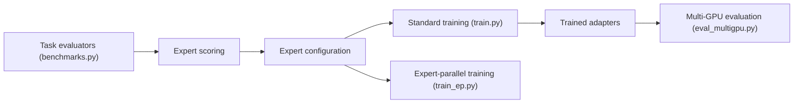

# deepseek-ai/ESFT

> Code officiel d'un affinage spécialisé par experts pour modèles de langage à mélange d'experts (MoE).

## Le problème
Affiner un LLM MoE entier coûte cher en calcul et en stockage, alors qu'une tâche n'active qu'une partie des experts.

## Ce que ça fait vraiment
Mesure l'activité des experts sur des données de tâche (intention, droit, résumé, traduction), calcule des scores, génère une configuration qui sélectionne les experts pertinents, puis n'entraîne que ceux-là (`train.py`, ou `train_ep.py` en parallélisme d'experts multi-GPU) et évalue l'adaptateur obtenu. Le modèle de base est `deepseek-ai/ESFT-vanilla-lite`.

## Comment c'est branché


## Essayer
```bash
pip install transformers torch safetensors accelerate
bash scripts/download_adapters.sh
python scripts/expert/get_expert_scores.py --eval_dataset=intent --base_model_path=deepseek-ai/ESFT-vanilla-lite --output_dir=results/expert_scores/intent --n_sample_tokens=131072 --world_size=4 --gpus_per_rank=2
python train.py --base_model_path=deepseek-ai/ESFT-vanilla-lite --expert_config=results/expert_configs/intent.json --train_dataset=intent --train_config=configs/base.yaml --output_dir=results/checkpoints/intent
```

## Coût et pièges
Plusieurs GPU (les exemples utilisent 4 à 8). Le script d'évaluation demande une clé OpenAI (`--openai_api_key`, juge GPT-4) à ta charge. Dernier push en mai 2025 ; la liste de tâches du README est restée à moitié cochée.

## Ce que ce n'est pas
Ce n'est pas un outil générique d'affinage : il cible les architectures MoE de DeepSeek. Le dépôt est un code de recherche, pas une bibliothèque packagée.

## Alternatives
Aucune alternative nommée dans le README.

## Pour toi
À surveiller : intéressant si tu affines des modèles MoE et veux économiser en calcul, mais le dépôt est figé depuis plus d'un an et demande du matériel conséquent.

