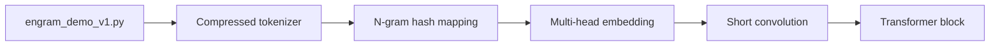

# deepseek-ai/Engram

> Code de démonstration du papier sur la mémoire conditionnelle Engram, pour chercheurs en modèles de langage.

## Le problème
Les Transformers n'ont pas de primitive native de recherche de connaissances : ils recalculent des motifs statiques dans leurs premières couches.

## Ce que ça fait vraiment
Implémente le module Engram : des n-grammes hachés vers une mémoire d'embeddings, récupérés en temps constant puis fusionnés aux états cachés. Le papier revendique une loi de répartition en U entre calcul MoE et mémoire. Le code fourni est une démo autonome (`engram_demo_v1.py`) où attention et MoE sont simulés ; ce n'est ni un entraînement ni un serveur de modèle.

## Comment c'est branché


## Essayer
```bash
pip install torch numpy transformers sympy
python engram_demo_v1.py
```

## Coût et pièges
Gratuit. La démo télécharge un tokenizer préentraîné via transformers. Aucun poids de modèle Engram n'est publié dans ce dépôt.

## Ce que ce n'est pas
Pas un modèle prêt à l'emploi : les résultats du papier (Engram-27B) ne sont pas reproductibles avec ce code.

## Alternatives
Aucune alternative citée dans le README.

## Pour toi
À surveiller : à lire pour comprendre l'idée avant qu'elle n'arrive dans de vrais modèles, sans rien en tirer d'opérationnel aujourd'hui.

