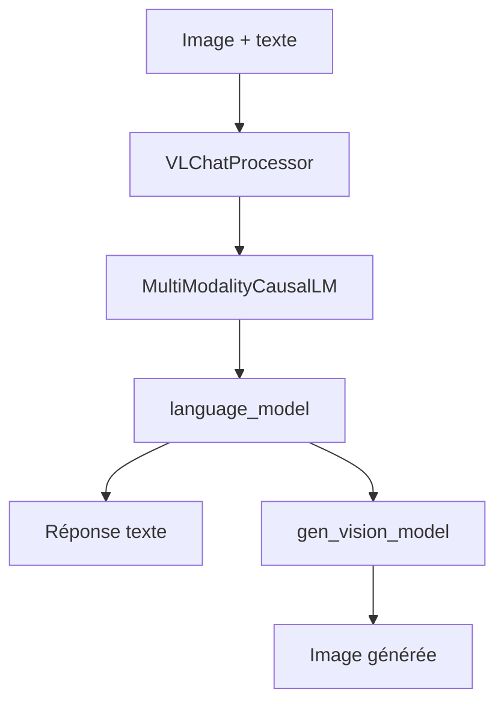

# deepseek-ai/Janus

> Code d'inférence des modèles multimodaux Janus de DeepSeek, pour comprendre et générer des images.

## Le problème
En général, il faut un modèle pour décrire une image et un autre pour en créer une. Janus veut un seul transformer pour les deux tâches.

## Ce que ça fait vraiment
Il y a trois variantes : Janus et Janus-Pro, autorégressifs avec un encodage visuel découplé, et JanusFlow, qui combine le modèle de langue et le rectified flow.
Poids de 1B, 1,3B et 7B sur Hugging Face, contexte de 4096.
Le README donne des exemples Python de compréhension d'image (`VLChatProcessor`) et de génération texte → image.
Des démos Gradio et FastAPI sont fournies.

## Comment c'est branché
Aucun composant n'est lisible dans le diagramme. Le schéma suit le README.


## Essayer
```bash
pip install -e .
pip install -e .[gradio]
python demo/app_januspro.py
python demo/fastapi_app.py
```

## Coût et pièges
Les exemples appellent `.cuda()`, donc il faut un GPU. JanusFlow demande en plus le VAE SDXL et `diffusers`.

## Ce que ce n'est pas
Ce n'est pas une bibliothèque maintenue : dernier push le 2025-02-01. Ce n'est pas un service : on ne peut que lancer les démos. Le code est sous MIT, mais les poids ont leur propre licence.

## Alternatives
Le README ne nomme aucun dépôt alternatif.

## Pour toi
À ignorer : un code de recherche figé depuis plus d'un an, utile seulement pour la curiosité sur les modèles multimodaux unifiés.
