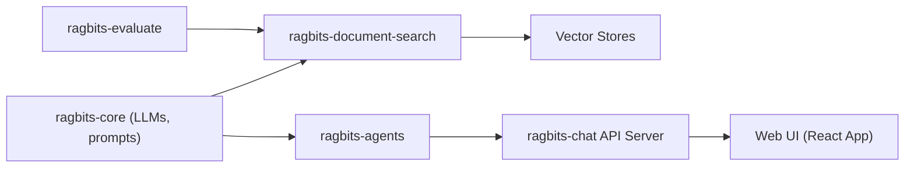

# deepsense-ai/ragbits

> Briques Python modulaires pour applications GenAI : LLM, RAG, agents, évaluation et interface de chat.

## Le problème
Monter une application RAG ou agentique oblige à assembler prompts, embeddings, stockage vectoriel, ingestion et interface.

## Ce que ça fait vraiment
Monorepo de paquets installables séparément : `ragbits-core` (prompts typés, LLM via LiteLLM, vector stores dont Qdrant et PgVector), `document-search` (ingestion de 20+ formats via Docling ou Unstructured, Ray en option), `agents` (A2A, MCP), `evaluate`, `guardrails`, `chat` (API + UI React) et `cli`. Traçage OpenTelemetry.

## Comment c'est branché


## Essayer
```bash
pip install ragbits
pip install ragbits --pre
uvx create-ragbits-app
```

## Coût et pièges
Clé d'API du fournisseur LLM et des embeddings (les exemples utilisent `gpt-4.1-nano` et `text-embedding-3-small`). L'`InMemoryVectorStore` des exemples ne persiste rien.

## Ce que ce n'est pas
Pas un produit fini : une boîte à outils dont les choix (parseur, base vectorielle, évals) restent à faire. Le graphe d'architecture est un guide générique, non inspecté dans le code.

## Alternatives
Aucune alternative nommée dans le README.

## Pour toi
À surveiller : base propre et modulaire pour du RAG en Python, à comparer à ce que ton équipe utilise déjà avant de migrer.
