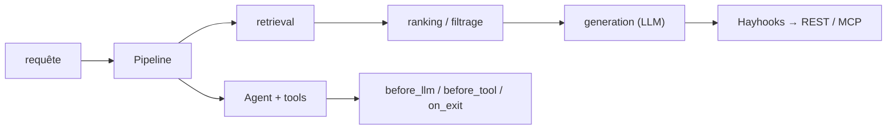

# deepset-ai/haystack

> Framework Python d'orchestration pour pipelines RAG et agents, avec contrôle explicite du contexte.

## Le problème
Les chaînes RAG « magiques » cachent où passe le contexte : impossible de savoir ce qui a été récupéré ni pourquoi.
Changer de modèle ou de base vectorielle oblige souvent à réécrire tout le système.

## Ce que ça fait vraiment
Des pipelines modulaires explicitent récupération, classement, filtrage, mémoire, routage et génération, avec boucles et branches.
Un même `Pipeline` tourne en synchrone ou asynchrone et diffuse token par token ; un `Agent` peut lancer des appels d'outils concurrents.
Hooks de cycle de vie (`before_llm`, `before_tool`, `on_exit`) pour les garde-fous, plus suivi de `step_count`, `token_usage` et appels d'outils.
Agent Pack fournit des agents prêts (recherche approfondie, RAG avancé) ; `SkillToolset` n'injecte les descriptions de skills qu'au besoin.

## Comment c'est branché


## Essayer
```sh
pip install haystack-ai
pip install --pre haystack-ai
```

## Coût et pièges
La bibliothèque est gratuite ; les modèles (OpenAI, Anthropic, Mistral, Bedrock, Azure…) sont facturés par leurs fournisseurs.
Haystack collecte des statistiques anonymes à l'initialisation des composants — la désactivation est documentée hors README.

## Ce que ce n'est pas
Ce n'est pas une application : pas d'UI, pas de service ; exposer un pipeline en REST ou MCP passe par Hayhooks.
Ce n'est pas stable entre majeures : la version courante est 3.0, annoncée comme une rupture.
Ce n'est pas un moteur de recherche : bases vectorielles et documentaires restent des dépendances externes.

## Alternatives
Hayhooks : le compagnon qui expose pipelines et agents en endpoints HTTP, MCP ou chat compatible OpenAI.

## Pour toi
Le framework à préférer quand tu veux voir et contrôler chaque étape du RAG plutôt que subir une abstraction.
