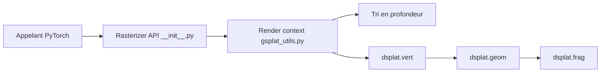

# dendenxu/fast-gaussian-rasterization

> Rasteriseur de Gaussian Splatting par shaders OpenGL, rendu direct, sans passe arrière.

## Le problème
Le rasteriseur CUDA d'origine (diff-gaussian-rasterization) est lent pour le rendu interactif à haute résolution.

## Ce que ça fait vraiment
Remplace l'import de `diff_gaussian_rasterization` par `fast_gauss`. Le tri en profondeur se fait sur GPU via CUDA, puis les shaders vertex/geometry/fragment d'OpenGL rasterisent. Annoncé 5 à 10 fois plus rapide si le framebuffer est écrit directement, 2 à 3 fois en rendu hors-ligne. Pas de backward, donc pas d'entraînement.

## Comment c'est branché


## Essayer
```bash
pip install fast_gauss
```
Puis remplacer `from diff_gaussian_rasterization import ...` par `from fast_gauss import GaussianRasterizationSettings, GaussianRasterizer`.

## Coût et pièges
GPU NVIDIA avec interop CUDA-OpenGL requis ; ni WSL ni macOS. Hors-ligne : environnement EGL parfois difficile. Canal alpha signalé comme défectueux.

## Ce que ce n'est pas
Pas un outil d'entraînement de splats. Sur nuages très denses (> 1 M de points), le CUDA d'origine peut être plus rapide.

## Alternatives
diff-gaussian-rasterization (l'original) et diff_gauss, cités comme sources de l'algorithme.

## Pour toi
À surveiller : intéressant pour visualiser des splats en temps réel, inutilisable pour entraîner, et sans mise à jour depuis février 2025.

