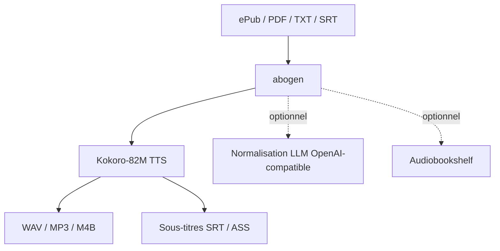

# denizsafak/abogen

> Outil text-to-speech qui transforme ePub/PDF/texte/markdown/sous-titres en audio avec sous-titres synchronisés.

## Le problème
Créer un audiobook ou une voix off à partir d'un document impose d'assembler TTS, découpage en chapitres et synchronisation des sous-titres à la main.

## Ce que ça fait vraiment
Convertit ePub, PDF, TXT, MD, SRT/ASS/VTT en audio (WAV/FLAC/MP3/OPUS/M4B avec chapitres) via Kokoro-82M, avec sous-titres synchronisés (ligne, phrase, mot, highlighting). Deux interfaces : GUI PyQt6 (`abogen`) et Web UI Flask (`abogen-web`, avec Supertonic TTS, normalisation LLM, intégration Audiobookshelf). Voice mixer, mode file d'attente, marqueurs de chapitres et métadonnées, découpage timestamp. Normalisation de texte via LLM OpenAI-compatible (Ollama…).

## Comment c'est branché


## Essayer
```bash
uv tool install --python 3.12 abogen[cuda] --extra-index-url https://download.pytorch.org/whl/cu128 --index-strategy unsafe-best-match
```
```bash
abogen-web
```

## Coût et pièges
Gratuit. espeak-ng requis. GPU NVIDIA (CUDA) recommandé ; AMD ROCm sur Linux seulement, CPU possible mais lent. Python 3.12/3.13 selon plateforme. Web UI en développement actif (features en avance sur le desktop). Normalisation LLM = clé/endpoint à ta charge. Mainteneur unique.

## Ce que ce n'est pas
Pas un clonage de voix arbitraire : voix Kokoro (mixables). Pas un service hébergé : local ou conteneur.

## Alternatives
Non nommées dans le README (Kokoro et Supertonic sont les moteurs, pas des substituts).

## Pour toi
Utile pour produire des audiobooks/voix off en local avec sous-titres ; l'intégration LLM/Ollama et le M4B chapitré sont des plus. Surveiller (mainteneur unique).
