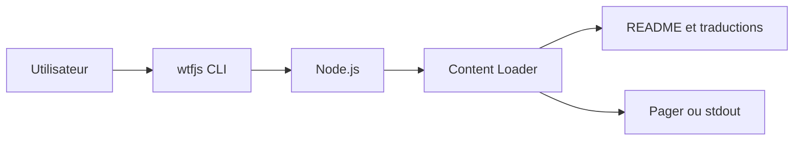

# denysdovhan/wtfjs

> Recueil d'exemples JavaScript déroutants, chacun expliqué, pour développeurs curieux des recoins du langage.

## Le problème
Les coercitions et règles de comparaison de JavaScript donnent des résultats contre-intuitifs qu'on découvre en production.

## Ce que ça fait vraiment
Le README est un manuel : chaque exemple montre une expression (`[] == ![]`, `NaN === NaN`, `parseInt(null, 24)`), son résultat, puis une explication avec renvoi à la section de la spécification ECMAScript. Il existe en plusieurs traductions et s'installe aussi comme paquet npm qui ouvre le texte dans le `$PAGER`.

## Comment c'est branché


## Essayer
```bash
npm install -g wtfjs
wtfjs
```

## Coût et pièges
Gratuit. Plusieurs exemples dépendent de vieux moteurs (bug V8 v5.5, IE11) : lire la mention d'environnement de chaque cas.

## Ce que ce n'est pas
Ce n'est pas un guide de bonnes pratiques ni un cours structuré ; les traductions peuvent être en retard sur l'anglais, le README le signale.

## Alternatives
Aucune alternative nommée dans le README (il cite wtfjs.com et la conférence « Wat » comme lectures).

## Pour toi
À surveiller : lecture utile si tu écris du JavaScript de temps en temps, sans rapport avec ton cœur de métier data/IA.

