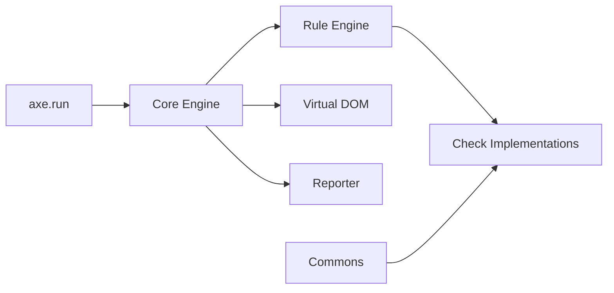

# dequelabs/axe-core

> Moteur de test d'accessibilité web (WCAG) à brancher dans ses tests automatisés.

## Le problème
Les défauts d'accessibilité sont repérés tard, par des outils peu fiables ou peu intégrés.

## Ce que ça fait vraiment
Exécute des règles WCAG 2.0/2.1/2.2 (A, AA, AAA) et de bonnes pratiques sur une page ; renvoie violations et éléments « incomplets » à revoir. Le README avance environ 57 % des problèmes WCAG détectés automatiquement. Localisable, configurable, gère les iframes.

## Comment c'est branché


## Essayer
```bash
npm install axe-core --save-dev
pnpm add --save-dev axe-core
```
```js
axe.run().then(results => {
  if (results.violations.length) throw new Error('Accessibility issues found');
});
```

## Coût et pièges
Gratuit ; licence MPL-2.0 (copyleft faible par fichier). Marques Deque protégées.

## Ce que ce n'est pas
Ne remplace pas un audit humain : la majorité des problèmes échappe à l'automatique.

## Alternatives
axe-linter (extension VS Code) et l'extension axe, recommandées par le README.

## Pour toi
Ignorer : utile pour un front web, hors du cœur data/IA/MLOps.

