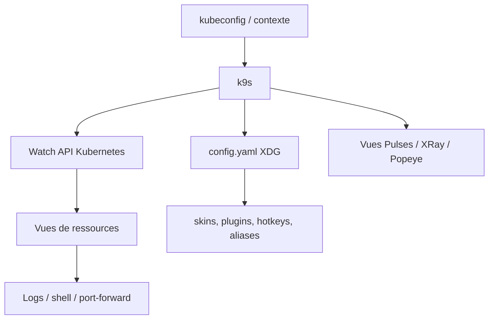

# derailed/k9s

> Interface terminal pour naviguer, observer et administrer un cluster Kubernetes.

## Le problème
`kubectl` oblige à retaper la même commande pour chaque ressource, chaque namespace, chaque contexte.
Suivre un pod qui redémarre en boucle demande trois terminaux et beaucoup de patience.

## Ce que ça fait vraiment
Interface terminal qui surveille en continu les changements du cluster et propose les commandes associées à la ressource observée.
Navigation par alias (`:pod`, `:ctx`, `:ns`), filtres regex et par labels, tri par colonne, marquage multiple, port-forward, shell dans un conteneur, logs et logs précédents, édition et suppression.
Vues intégrées : Pulses, XRay, Popeye, benchmarks de services, screendumps.
Configuration YAML sous XDG (`config.yaml`) : intervalle de rafraîchissement, timeout API, mode lecture seule, skins, plugins, hotkeys, alias, vues personnalisées, vendeurs de GPU.

## Comment c'est branché


## Essayer
```shell
brew install derailed/k9s/k9s
k9s -n mycoolns
k9s --readonly
k9s info
docker run --rm -it -v ~/.kube/config:/root/.kube/config derailed/k9s
```

## Coût et pièges
Gratuit ; le README rappelle que le projet repose sur son mainteneur et appelle au sponsoring.
Prérequis terminal : `TERM=xterm-256color`, `KUBE_EDITOR` défini pour éditer ; k9s préfère Kubernetes 1.28+.

## Ce que ce n'est pas
Ce n'est pas un outil de déploiement ni un GitOps : il observe et manipule l'existant.
Ce n'est pas un projet porté par une fondation : un seul mainteneur principal, financement par dons.
Le README affiche lui-même une note « encore en flux, susceptible de changer » sur la configuration ; le README fourni est tronqué en cours de section configuration.

## Alternatives
- popeye — lancé depuis k9s (`:popeye`), spécialisé dans l'audit de configuration plutôt que la navigation.

## Pour toi
À installer sans hésiter dès que tu touches à un cluster : gain de temps immédiat, coût d'apprentissage d'une heure.
