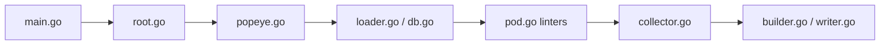

# derailed/popeye

> Linter en lecture seule qui inspecte un cluster Kubernetes vivant et signale les mauvaises configurations.

## Le problème
Sur un cluster qui grossit, personne ne repère les ressources orphelines, sondes manquantes, images `latest` ou limites mal réglées.

## Ce que ça fait vraiment
Interroge l'API Kubernetes, charge les ressources en base mémoire, applique des linters par type (Node, Pod, Service, Secret, ConfigMap, RBAC, HPA, Gateway API…) et produit un rapport noté de 0 à 100. Formats : standard, YAML, JSON, HTML, JUnit, Prometheus, score. Un fichier « spinach » règle seuils et exclusions. Peut pousser des métriques vers un Pushgateway et tourner en CronJob.

## Comment c'est branché


## Essayer
```bash
brew install derailed/popeye/popeye
popeye
popeye -n fred
popeye -A
popeye -f spinach.yaml
popeye -o html --save
```

## Coût et pièges
Gratuit. Il faut des droits `get/list` sur de nombreuses ressources (ClusterRole fourni). Sans metrics-server, pas d'analyse de sur/sous-allocation. Sort en erreur s'il trouve des problèmes : utiliser `--force-exit-zero` en CronJob.

## Ce que ce n'est pas
Pas un scanner de manifestes sur disque ni un outil qui corrige. Le README se dit « brittle » et plus fiable vers Kubernetes 1.25 ; la licence est ambiguë (le catalogue ne l'identifie pas, le README dit Apache v2).

## Alternatives
Aucune alternative citée dans le README.

## Pour toi
À surveiller : utile pour auditer un cluster qui héberge tes services ML, mais dernier push en décembre 2025 et licence à confirmer.

