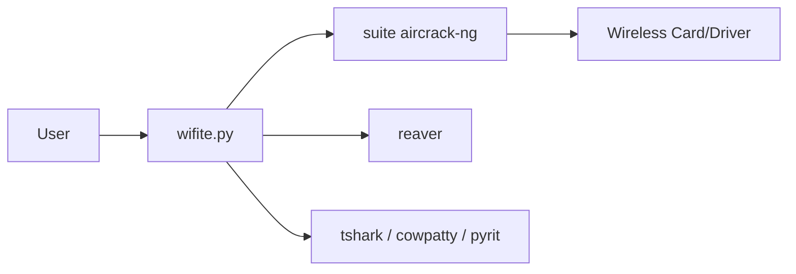

# derv82/wifite

> Script Python 2 historique orchestrant les outils aircrack-ng pour auditer des réseaux Wi-Fi, remplacé par Wifite2.

## Le problème
Auditer la sécurité d'un réseau sans fil demande d'enchaîner à la main plusieurs programmes distincts de la suite aircrack-ng.

## Ce que ça fait vraiment
- Un seul fichier, `wifite.py`, lance en sous-processus airmon-ng, airodump-ng, aireplay-ng, packetforge-ng et aircrack-ng.
- Il peut aussi s'appuyer sur reaver, pyrit, tshark et cowpatty s'ils sont installés.
- Il suppose Linux, les droits root et une carte Wi-Fi compatible mode moniteur et injection.
- Le README indique « mode life-support » et renvoie vers Wifite2.

## Comment c'est branché


## Essayer
```bash
wget https://raw.github.com/derv82/wifite/master/wifite.py
chmod +x wifite.py
./wifite.py
```

## Coût et pièges
Gratuit, mais Python 2.7 et root exigés ; le README déconseille de lancer un script téléchargé en root et conseille une distribution dédiée ou une VM avec dongle USB.

## Ce que ce n'est pas
Ce n'est pas la version maintenue : 129 issues ouvertes, dernier push en 2022. Son usage n'est licite que sur des réseaux dont on a l'autorisation. Le catalogue ne détecte aucune licence, alors que le README cite la GPL v2.

## Alternatives
- Wifite2 (derv82/wifite2) : successeur cité par le README, plus fiable et riche.

## Pour toi
Ignorer : version abandonnée, Python 2, hors du périmètre data/IA ; préférer Wifite2 si un audit Wi-Fi autorisé est nécessaire.

