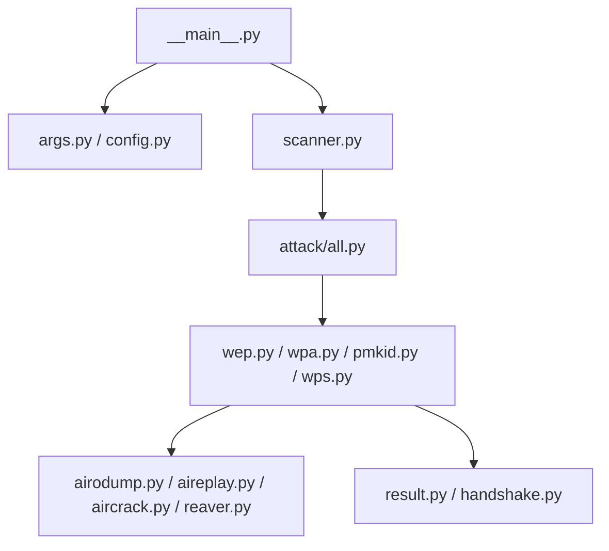

# derv82/wifite2

> Outil en ligne de commande d'audit de réseaux Wi-Fi, qui orchestre des utilitaires sans fil existants.

## Le problème
Un audit de sécurité Wi-Fi mobilise plusieurs outils séparés à enchaîner à la main.

## Ce que ça fait vraiment
Le README est réduit à un avis : une nouvelle version, **wifit3**, existe, avec ses propres pilotes en espace utilisateur pour adaptateurs USB, sous Linux et Windows. D'après le code, wifite2 scanne les points d'accès, laisse choisir des cibles, puis délègue à des modules par protocole (WEP, WPA, PMKID, WPS) et sait vérifier ou traiter des captures. Une partie du code n'a pas été échantillonnée : le reste n'est pas documenté ici.

## Comment c'est branché

## Essayer
Aucune commande documentée dans le README fourni.

## Coût et pièges
Gratuit. Exige un adaptateur Wi-Fi compatible et les outils externes installés. 351 issues ouvertes.

## Ce que ce n'est pas
Ce n'est pas un outil grand public : à n'utiliser que sur ses propres réseaux ou avec autorisation écrite ; sinon la loi l'interdit dans la plupart des pays. Le README indique que la suite du projet est wifit3.

## Alternatives
- wifit3 : version indiquée par le README, avec pilotes USB propres, Linux et Windows.

## Pour toi
Ignorer : hors périmètre data / IA / MLOps, et le README renvoie lui-même vers un successeur.

