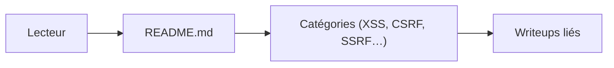

# devanshbatham/Awesome-Bugbounty-Writeups

> Liste de comptes rendus de chasse aux bugs classés par type de faille, pour apprenants en sécurité web.

## Le problème
Les retours d'expérience de bug bounty sont dispersés sur des blogs.

## Ce que ça fait vraiment
Un README qui recense des articles par catégorie : XSS (la plus fournie), CSRF, clickjacking, LFI, prise de sous-domaine, DoS, contournement d'authentification, injection SQL, IDOR, 2FA, CORS, SSRF, conditions de course, exécution de code, débordement de tampon, Android. Aucune exécution : le code n'est qu'un TODO d'auto-mise à jour.

## Comment c'est branché

## Essayer
Rien à installer : lire le README sur GitHub.

## Coût et pièges
Gratuit. Le dernier push date d'août 2023 : des liens sont probablement morts. Aucune licence déclarée.

## Ce que ce n'est pas
Pas un cours structuré ni un outil : des titres d'articles, souvent sans résumé.

## Alternatives
Aucune nommée dans le README.

## Pour toi
À ignorer : sécurité offensive web, sans rapport avec ton métier, et ancienne.

