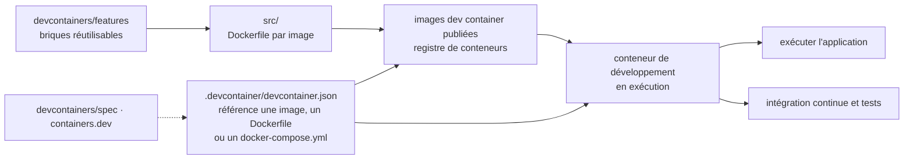

# devcontainers/images

> **The set of published Docker images you reference from a `devcontainer.json` instead of writing your own Dockerfile.**

## The problem

Without these images, every project that wants a containerised development environment starts
again from a hand-written `Dockerfile`: pick a base image, put Git back in, a usable shell, a
non-root user, the language runtime at the right version. The same work is redone in every
repository, with drifts that get paid for the day the local environment and the CI environment
stop behaving the same way.

## What it actually does

The repository publishes a set of Docker images meant to be used as development containers: a
running container carrying a project's tool and runtime stack, usable to run the application,
to keep tools and libraries off the host, and for continuous integration and testing.

These images are not hand-written Dockerfiles end to end: the README states they are built
with the **dev container features** from
[devcontainers/features](https://github.com/devcontainers/features). The repository is as much
an assembly of versioned building blocks as it is an image catalogue.

The content fits in a single announced directory: [`src`](src), which "contains reusable dev
container images". The README does not list the available images, gives neither their names
nor their version tags, and never says which registry they are published to — you have to open
`src` or the external documentation to find out.

The rest of the README is a FAQ: how the repository relates to the specification
([devcontainers/spec](https://github.com/devcontainers/spec), [containers.dev](https://containers.dev/)),
what `devcontainer.json` is for, why `RUN` statements chain commands with `&&` so that a Docker
layer does not keep temporary files deleted in a later step, and the contribution policy. That
last point is explicit and matters: the repository holds a **selected set of images** and
encourages the community to host and share additional images and features elsewhere rather
than adding them here.

## How it is wired



No code-derived diagram exists for this repository: this one is reconstructed from the README
alone. The only file or directory name the README gives is `src`; image and Dockerfile names
do not appear in it.

## Trying it

```
No command is documented in the README: no docker pull, no build, no complete
devcontainer.json example.
```

The README describes the entry point in prose — "all you need is a `.devcontainer/devcontainer.json`
file in your project that references an image, `Dockerfile`, or `docker-compose.yml`, and a few
properties" — but never shows its contents. Nothing is reconstructed here: open `src` or
[containers.dev](https://containers.dev/) for the exact syntax and the name of the image you
want.

## Cost and traps

- **Docker is required**, by definition: a development container is a running Docker
  container. No Docker, no story. The README puts no figure on minimum resources.
- **Free, but dependent on a third-party registry.** The README does not name the registry; for
  images generated from this repository it points to a legal notice hosted under
  `microsoft/containerregistry` (Container-Images-Legal-Notice) and to a `NOTICE.txt`. Two
  licensing regimes therefore coexist: MIT for the repository code, a separate notice for the
  published images. Read it before any redistribution.
- **The README never says what the catalogue contains**: no image list, no version matrix, no
  update or end-of-support policy. From this page alone you cannot decide whether the stack you
  need is covered.
- **The scope is deliberately closed**: the repository states it does not take new images. If
  the missing image is yours, the documented answer is to host it yourself, not to open a pull
  request here.
- **Images draw their content from features**: a defect in an image may come from
  `devcontainers/features`, that is, from a repository other than the one where you report it.

## What it is not

- **It is not the dev container specification.** That lives in `devcontainers/spec` and on
  containers.dev. This repository only supplies images usable in configurations that follow
  the spec.
- **It is not the tool that starts the container**: nothing here opens, builds or attaches an
  environment. An editor or the dev container CLI reads `devcontainer.json`; this repository
  only provides the target that file references.
- **It is not an exhaustive or community catalogue**: the README says "a select set of images"
  and explicitly redirects additions elsewhere. Do not look here for your exotic stack.
- **It is not a production image set.** These are development and test environments; the README
  never presents them as a runtime base for a shipped service.

## Alternatives

| | When to prefer it |
|---|---|
| **devcontainers/features** | Named in the README, it is the building block these images are made of. Prefer it when a base image is already imposed on you and you only want to add tooling, rather than adopting a ready-made image. |
| **devcontainers/spec** | Named in the README: the specification and `containers.dev`. Read it instead of this repository when the question is "how do I write my `devcontainer.json`" rather than "which image do I reference". |

The catalogue neighbours (`kubernetes/kubernetes`, `moby/moby`, `aquasecurity/trivy`,
`podman-container-tools/podman`) share the container vocabulary but not the use case: an
orchestrator, an engine, a vulnerability scanner and an alternative runtime do not replace a
set of ready-to-reference development images.

## For you

Useful as a starting point for a reproducible environment on a data or AI project — the same
image on your machine, your colleague's and in CI removes a whole class of "works on my
machine" problems. Worth watching rather than adopting blindly: the README says neither which
images exist nor how they are versioned, and a data stack (CUDA, GPU drivers, pinned Python
versions) is not what this catalogue promises to cover. Go read `src` before committing.
