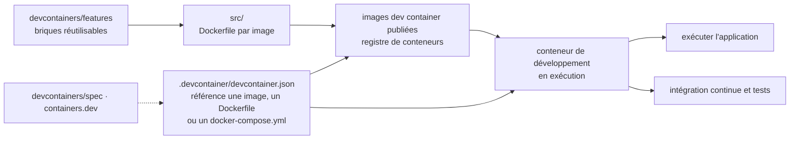

# devcontainers/images

> **Le jeu d'images Docker publiées que l'on référence dans un `devcontainer.json` plutôt que d'écrire son Dockerfile.**

## Le problème

Sans ces images, chaque projet qui veut un environnement de développement en conteneur repart
d'un `Dockerfile` maison : choisir l'image de base, y remettre Git, un shell utilisable, un
utilisateur non-root, la pile de langage à la bonne version. Le même travail est refait dans
chaque dépôt, avec des divergences qui se paient au moment où l'environnement local et celui
de l'intégration continue ne se comportent plus pareil.

## Ce que ça fait vraiment

Le dépôt publie un ensemble d'images Docker prêtes à servir de conteneur de développement : un
conteneur qui embarque la pile d'outils et de runtimes d'un projet, utilisable pour exécuter
l'application, pour isoler les outils du poste, et pour l'intégration continue et les tests.

Ces images ne sont pas des `Dockerfile` écrits à la main de bout en bout : le README précise
qu'elles sont construites avec les **dev container features** du dépôt
[devcontainers/features](https://github.com/devcontainers/features). Le dépôt est donc autant
un assemblage de briques versionnées qu'un catalogue d'images.

Le contenu tient en un seul répertoire annoncé : [`src`](src), « contains reusable dev
container images ». Le README ne liste pas les images disponibles, ne donne ni leurs noms ni
leurs étiquettes de version, et ne dit pas dans quel registre elles sont publiées — il faut
ouvrir `src` ou la documentation externe pour le savoir.

Le reste du README est une FAQ : le rapport à la spécification
([devcontainers/spec](https://github.com/devcontainers/spec), [containers.dev](https://containers.dev/)),
le rôle de `devcontainer.json`, une explication des `RUN` chaînés par `&&` pour éviter qu'une
couche Docker conserve des fichiers temporaires supprimés plus tard, et la politique de
contribution. Cette dernière est explicite et compte : le dépôt **contient un jeu d'images
sélectionné** et invite la communauté à héberger et partager ses propres images et features
ailleurs plutôt que de les ajouter ici.

## Comment c'est branché



Aucun diagramme tiré du code n'existe pour ce dépôt : ce schéma est reconstruit depuis le seul
README. Le seul nom de fichier ou de répertoire que le README donne est `src` ; les noms des
images et des `Dockerfile` n'y figurent pas.

## Essayer

```
Aucune commande n'est documentée dans le README : ni docker pull, ni build, ni exemple de
devcontainer.json complet.
```

Le README décrit le point d'entrée en prose — « tout ce dont vous avez besoin est un fichier
`.devcontainer/devcontainer.json` dans votre projet qui référence une image, un `Dockerfile`
ou un `docker-compose.yml`, et quelques propriétés » — mais sans en donner le contenu. Rien
n'est reconstruit ici : il faut ouvrir `src` ou [containers.dev](https://containers.dev/) pour
la syntaxe exacte et le nom de l'image voulue.

## Coût et pièges

- **Docker requis**, par définition : un conteneur de développement est un conteneur Docker en
  cours d'exécution. Pas de Docker, pas de sujet. Aucune ressource minimale n'est chiffrée dans
  le README.
- **Gratuit, mais dépendant d'un registre tiers.** Le README ne nomme pas le registre ; il
  renvoie, pour les images produites par ce dépôt, à un avis légal hébergé chez
  `microsoft/containerregistry` (Container-Images-Legal-Notice) et à un `NOTICE.txt`. Deux
  licences coexistent donc : MIT pour le code du dépôt, un avis distinct pour les images
  publiées. C'est à lire avant toute redistribution.
- **Le README ne dit pas ce que contient le catalogue** : pas de liste d'images, pas de
  matrice de versions, pas de politique de mise à jour ni de fin de support. Impossible de
  décider depuis cette seule page si la pile dont on a besoin est couverte.
- **Le périmètre est volontairement fermé** : le dépôt affiche qu'il n'accueille pas de
  nouvelles images. Si l'image manquante est la vôtre, la réponse documentée est de l'héberger
  vous-même, pas d'ouvrir une pull request ici.
- **Les images tirent leur contenu des features** : un problème dans une image peut venir de
  `devcontainers/features`, donc d'un autre dépôt que celui où l'on signale l'incident.

## Ce que ce n'est pas

- **Ce n'est pas la spécification dev container.** Elle vit dans `devcontainers/spec` et sur
  containers.dev. Ce dépôt ne fait que fournir des images utilisables dans des configurations
  qui suivent cette spécification.
- **Ce n'est pas l'outil qui lance le conteneur** : rien ici n'ouvre, ne construit ni
  n'attache un environnement. C'est l'éditeur ou la CLI dev container qui lit le
  `devcontainer.json` ; ce dépôt ne fournit que la cible que ce fichier référence.
- **Ce n'est pas un catalogue exhaustif ni communautaire** : le README parle d'un « select set
  of images » et redirige explicitement les ajouts ailleurs. Ne pas y chercher l'image de sa
  pile exotique.
- **Ce n'est pas une image de production.** Ce sont des environnements de développement et de
  test ; le README ne les présente jamais comme base d'exécution d'un service livré.

## Alternatives

| | Quand le préférer |
|---|---|
| **devcontainers/features** | Nommé dans le README, c'est la brique dont ces images sont faites. À préférer quand on a déjà une image de base imposée et qu'on veut seulement y ajouter des outils, plutôt que d'adopter une image toute faite. |
| **devcontainers/spec** | Nommé dans le README : la spécification et `containers.dev`. À lire plutôt que ce dépôt si la question est « comment écrire mon `devcontainer.json` » et non « quelle image référencer ». |

Les voisins proposés par le catalogue (`kubernetes/kubernetes`, `moby/moby`,
`aquasecurity/trivy`, `podman-container-tools/podman`) partagent le lexique des conteneurs mais
pas l'usage : orchestrateur, moteur, scanner de vulnérabilités et runtime alternatif ne
remplacent pas un jeu d'images de développement prêtes à référencer.

## Pour toi

Utile comme point de départ d'un environnement reproductible pour un projet data ou IA — la
même image entre le poste, le collègue et l'intégration continue règle la classe de problèmes
« ça marche chez moi ». À surveiller plutôt qu'à adopter les yeux fermés : le README ne dit ni
quelles images existent, ni comment elles sont versionnées, et une pile data (CUDA, pilotes
GPU, versions de Python figées) n'est pas ce que ce catalogue promet de couvrir. Aller voir
`src` avant de s'engager.
