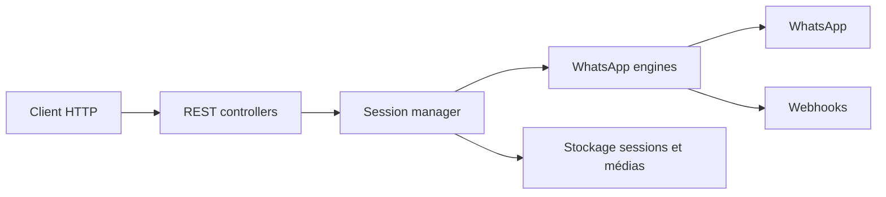

# devlikeapro/waha

> API HTTP WhatsApp auto-hébergée dans Docker, pour envoyer des messages par REST.

## Le problème
Automatiser des messages WhatsApp demande de gérer sessions, QR code et moteur de connexion.

## Ce que ça fait vraiment
Un conteneur expose une API REST (Swagger inclus) : on crée une session, on scanne un QR, puis on envoie des messages. Le code décrit plusieurs moteurs, des webhooks, WebSocket, l'intégration Chatwoot, des outils MCP, des métriques Prometheus et un tableau de bord. La version WAHA Plus est distincte (image privée sur identifiants).

## Comment c'est branché


## Essayer
```bash
docker pull devlikeapro/waha
docker run -it --rm -p 3000:3000/tcp --name waha devlikeapro/waha
curl -d "{\"chatId\": \"${PHONE}@c.us\", \"text\": \"Hello from WhatsApp HTTP API\" }" -H "Content-Type: application/json" -X POST http://localhost:3000/api/sendText
```

## Coût et pièges
Gratuit pour la version de base ; multi-sessions dans Plus (payant). Un téléphone avec WhatsApp est requis pour le QR.

## Ce que ce n'est pas
Pas l'API officielle de WhatsApp Business : risque de blocage du compte, non documenté dans le README.

## Alternatives
Aucune alternative nommée dans le README.

## Pour toi
Surveiller : brique pratique pour brancher un agent ou un LLM sur WhatsApp, avec le risque de conformité à évaluer.

