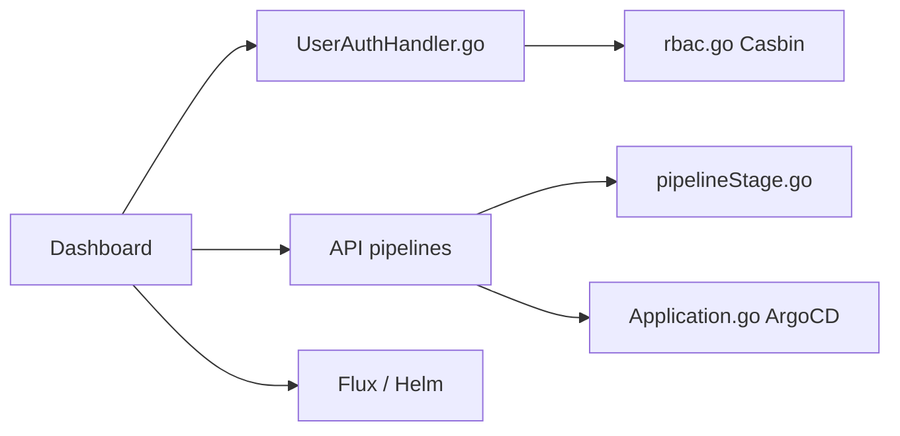

# devtron-labs/devtron

> Tableau de bord et plateforme CI/CD Kubernetes qui unifie Helm, ArgoCD et FluxCD sur plusieurs clusters.

## Le problème
Gérer des applications Helm et GitOps sur plusieurs clusters exige de jongler entre outils et droits d'accès.

## Ce que ça fait vraiment
Le tableau de bord gère les applications Helm avec retour arrière, explore les ressources (nœuds, pods, CRD), compare les dérives de configuration et applique SSO et RBAC (Dex, Casbin). Le mode plateforme ajoute pipelines CI/CD sans code, ArgoCD, scan Trivy ou Clair, notifications, Grafana et métriques de déploiement. NATS relie les microservices.

## Comment c'est branché


## Essayer
```bash
helm repo add devtron https://helm.devtron.ai
helm install devtron devtron/devtron-operator \
--create-namespace --namespace devtroncd
kubectl -n devtroncd get secret devtron-secret -o jsonpath='{.data.ADMIN_PASSWORD}' | base64 -d
```

## Coût et pièges
Gratuit ; il faut un cluster Kubernetes et Helm. 770 issues ouvertes. L'installation complète active plusieurs composants (Argo CD, Trivy, Grafana).

## Ce que ce n'est pas
Pas spécifique au ML : c'est une plateforme de livraison générale. Le scan de vulnérabilités ne porte que sur le moment du build d'image.

## Alternatives
- ArgoCD et FluxCD : intégrés plutôt que remplacés.

## Pour toi
À surveiller : pertinent si ton équipe MLOps gère un cluster partagé ; superflu si tu déploies déjà avec ArgoCD seul.

