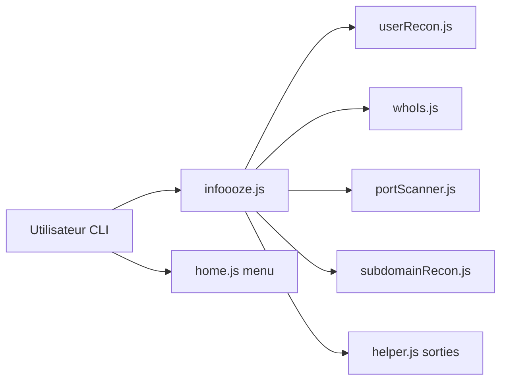

# devxprite/infoooze

> Outil en ligne de commande Node.js de reconnaissance OSINT : Whois, IP, DNS, sous-domaines, ports.

## Le problème
Rassembler des informations publiques sur un domaine, une IP ou un utilisateur oblige à enchaîner de nombreux outils.

## Ce que ça fait vraiment
Un seul CLI regroupe une dizaine de modules : recherche de nom d'utilisateur, email, Instagram, GitHub, Whois, IP, DNS, entêtes, âge du domaine, sous-domaines, scan de ports, EXIF, YouTube, URL. Menu interactif ou options, résultats enregistrables dans un fichier texte.

## Comment c'est branché


## Essayer
```bash
sudo npm install infoooze -g -s
infoooze -w google.com
infoooze -s google.com
infoooze -p 8.8.8.8
```

## Coût et pièges
Gratuit. Dernier push en octobre 2023. Il interroge des services externes dont l'état n'est pas garanti. Le scan de ports sur des cibles non autorisées est illégal.

## Ce que ce n'est pas
Pas une suite de sécurité complète. Les capacités du README dépassent ce que le code échantillonné montre.

## Alternatives
Aucune alternative citée dans le README.

## Pour toi
À ignorer : OSINT hors périmètre data/IA, et projet inactif depuis 2023.

