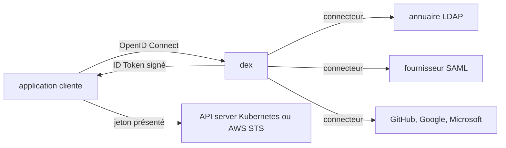

# dexidp/dex

> **A single sign-on doorway.** An OpenID Connect provider that defers login to LDAP, SAML, GitHub or Google.

## The problem

Without dex, every application has to speak LDAP, SAML, GitHub or Active Directory on its own:
as many protocols as there are backends, and authentication code to write, test and maintain in
each service. On a Kubernetes cluster it also means there is no single place to plug the
company's identities into.

## What it actually does

Dex is an identity service that speaks OpenID Connect to its clients and hooks into existing
user-management systems through what it calls "connectors". Its primary feature is issuing
**ID Tokens**: JSON Web Tokens signed by dex and returned as part of the OAuth2 response,
carrying standard claims (`iss`, `sub`, `aud`, `exp`, `email`, `groups`, `name`). Because those
tokens are signed and standards-based, other services consume them directly as service-to-service
credentials — the README names Kubernetes and AWS STS. Clients learn one protocol, OIDC; dex
implements the rest. On Kubernetes, dex runs natively using Custom Resource Definitions and can
drive API server authentication through the OpenID Connect plugin, so `kubectl` or `kubelogin`
act on behalf of the user.

## How it is wired



The README does not describe the code layout, only this flow: the client app knows dex alone and
talks OIDC to it; dex translates towards the upstream provider through a connector, then returns
a signed ID Token the app can present in turn to an OIDC consumer such as the Kubernetes API
server. The connector choice has direct consequences on that flow: depending on the upstream
protocol, dex may be unable to issue a refresh token or to return group membership claims.

## Trying it

```bash
# no install or startup command is documented in this README
```

The README only points to the official documentation (dexidp.io/docs) for getting started,
configuration and usage guides, plus a dedicated guide for running dex as a Kubernetes
authenticator. Nothing is reconstructed here.

## Cost and traps

The project is Apache 2.0 licensed and charges nothing. The real cost is operational: one more
authentication service to run, plus at least one upstream identity provider (an LDAP directory,
a SAML tenant, a GitHub org…) which may itself be paid or require creating an account. The main
trap is flagged by the README itself: the SAML 2.0 connector is described as unmaintained and
likely vulnerable to auth bypasses. Another one: connector maturity is uneven — LDAP and GitHub
are "stable", GitLab, OIDC, LinkedIn, Microsoft, Gitea and Atlassian Crowd are "beta", while
OAuth 2.0, Google, AuthProxy, Bitbucket Cloud, OpenShift and Keystone are "alpha", meaning
possibly untested by core maintainers and subject to backward incompatible changes. Finally,
some connectors cannot issue refresh tokens (SAML, OAuth 2.0, AuthProxy), which breaks clients
needing offline access such as `kubectl`.

## What it is not

It is not a directory or a user store: dex does not hold your identities, it sits in front of a
user-management system that already exists. It is not an authorization solution either: it
attests who the user is and surfaces their groups, but access decisions stay with whoever
consumes the token. And it is not a turnkey SaaS: it is a component you host and configure
yourself.

## Alternatives

The README names no competitor. Among the supplied neighbours, `argoproj/argo-cd` and
`goharbor/harbor` are consumers of OIDC authentication rather than substitutes — they often embed
dex as an internal building block, which the README does not confirm. `containerd/containerd`
and `argoproj/argo-workflows` are off topic here. In short: no comparable alternative in the
catalogue.

## For you

On a data/ML platform running on Kubernetes, dex is the piece that lets `kubectl`, internal UIs
and notebooks share the company SSO without rewriting authentication code. Worth adopting if you
already have a directory; skip it if you only have a handful of users, since it is one more
service to operate.
