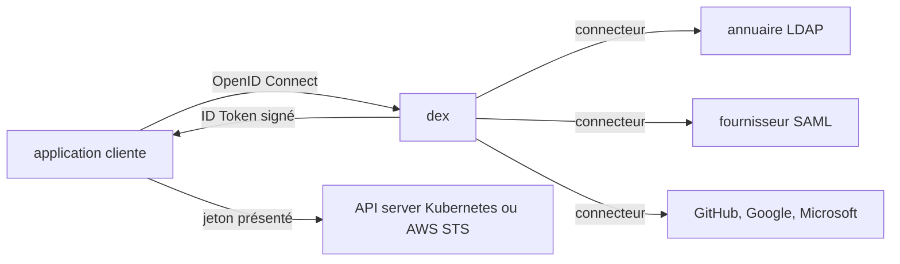

# dexidp/dex

> **Portail d'authentification unique.** Un fournisseur OpenID Connect qui délègue le login à LDAP, SAML, GitHub ou Google.

## Le problème

Sans dex, chaque application doit implémenter elle-même le dialogue avec LDAP, SAML, GitHub,
Active Directory et consorts — autant de protocoles différents, autant de code d'authentification
à écrire, tester et maintenir dans chaque service. Sur un cluster Kubernetes, cela veut aussi
dire qu'il n'existe aucun point unique où brancher les identités de l'entreprise.

## Ce que ça fait vraiment

Dex est un service d'identité qui parle OpenID Connect à ses clients et, derrière, se branche
sur les annuaires existants via ce qu'il appelle des « connecteurs ». Sa fonctionnalité première
est l'émission d'**ID Tokens** : des JSON Web Tokens signés par dex, renvoyés dans la réponse
OAuth2, qui portent les claims standard (`iss`, `sub`, `aud`, `exp`, `email`, `groups`, `name`).
Comme ces jetons sont signés et normalisés, d'autres services les consomment directement comme
identifiants de service à service — le README cite Kubernetes et AWS STS. Le client n'apprend
qu'un seul protocole, OIDC ; dex implémente le reste. Sur Kubernetes, dex tourne nativement en
s'appuyant sur des Custom Resource Definitions et alimente l'authentification de l'API server
via le plugin OpenID Connect ; `kubectl` ou `kubelogin` agissent alors au nom de l'utilisateur.

## Comment c'est branché



Le README ne décrit pas l'arborescence du code, seulement ce flux : l'application ne connaît que
dex et le parle en OIDC ; dex traduit vers l'annuaire amont au moyen d'un connecteur, puis
renvoie un ID Token signé que l'application peut à son tour présenter à un consommateur OIDC
comme l'API server Kubernetes. Le choix du connecteur a des conséquences directes sur ce flux :
selon le protocole amont, dex peut être incapable d'émettre un refresh token ou de remonter les
groupes.

## Essayer

```bash
# aucune commande d'installation ni de démarrage n'est documentée dans ce README
```

Le README renvoie uniquement vers la documentation officielle (dexidp.io/docs) pour la prise en
main, la configuration et l'usage, ainsi que vers un guide dédié à l'usage de dex comme
authentificateur Kubernetes. Rien n'est reconstruit ici.

## Coût et pièges

Le projet est sous Apache 2.0 et ne facture rien. Le vrai coût est opérationnel : il faut
exploiter un service d'authentification supplémentaire, et disposer d'au moins un fournisseur
d'identité amont (annuaire LDAP, tenant SAML, organisation GitHub…), qui lui peut être payant ou
imposer la création d'un compte. Piège majeur signalé par le README lui-même : le connecteur
SAML 2.0 est décrit comme non maintenu et vraisemblablement vulnérable à des contournements
d'authentification. Autre piège : la maturité des connecteurs est inégale — LDAP et GitHub sont
« stable », GitLab, OIDC, LinkedIn, Microsoft, Gitea et Atlassian Crowd sont « beta », OAuth 2.0,
Google, AuthProxy, Bitbucket Cloud, OpenShift et Keystone sont « alpha », c'est-à-dire
possiblement non testés par les mainteneurs et sujets à des ruptures de compatibilité. Enfin,
certains connecteurs ne savent pas émettre de refresh token (SAML, OAuth 2.0, AuthProxy), ce qui
bloque les clients à accès hors ligne comme `kubectl`.

## Ce que ce n'est pas

Ce n'est pas un annuaire ni un magasin d'utilisateurs : dex ne stocke pas vos identités, il
s'intercale devant un système de gestion d'utilisateurs qui existe déjà. Ce n'est pas non plus
une solution d'autorisation : il atteste qui est l'utilisateur et remonte ses groupes, mais les
décisions de droits restent chez le consommateur du jeton. Et ce n'est pas un SaaS clé en main :
c'est un composant à héberger et configurer soi-même.

## Alternatives

Le README ne nomme aucun concurrent. Parmi les voisins fournis, `argoproj/argo-cd` et
`goharbor/harbor` sont plutôt des consommateurs d'authentification OIDC que des substituts — ils
embarquent d'ailleurs souvent dex comme brique interne, ce que le README ne confirme pas.
`containerd/containerd` et `argoproj/argo-workflows` sont hors sujet ici. Autrement dit : aucune
alternative comparable dans le catalogue.

## Pour toi

Sur une plateforme data/ML qui tourne sur Kubernetes, dex est la brique qui permet à `kubectl`,
aux UI internes et aux notebooks de partager le SSO de l'entreprise sans réécrire de code
d'authentification. À adopter si vous avez déjà un annuaire ; à éviter si vous n'avez qu'une
poignée d'utilisateurs, car c'est un service de plus à exploiter.
