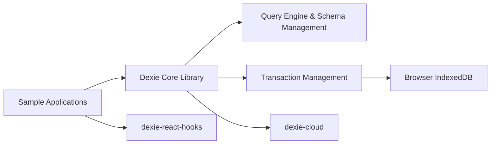

# dexie/Dexie.js

> Surcouche JavaScript d'IndexedDB pour stocker et requêter des données dans le navigateur.

## Le problème
L'API IndexedDB native est verbeuse, bugguée selon les navigateurs, et pénible pour les requêtes.

## Ce que ça fait vraiment
Déclaration de schéma versionné, requêtes chaînées (`where().below()`), opérations en masse.
Contourne des bugs d'implémentation d'IndexedDB.
Hooks React (`useLiveQuery`) et tutoriels Svelte, Vue, Angular.
Add-on Dexie Cloud : synchro temps réel, auth, contrôle d'accès, offline-first.

## Comment c'est branché


## Essayer
```bash
npm install dexie
npm install dexie-cloud-addon
pnpm install
pnpm run build
```

## Coût et pièges
Bibliothèque gratuite ; Dexie Cloud est un service (hébergé ou auto-hébergé).

## Ce que ce n'est pas
Pas une base serveur. `dexie-observable` et `dexie-syncable` sont dépréciés, à ne pas utiliser.

## Alternatives
Aucune alternative nommée dans le README.

## Pour toi
À ignorer côté data/ML : stockage navigateur pour apps web, hors de ton périmètre sauf démo front offline.
