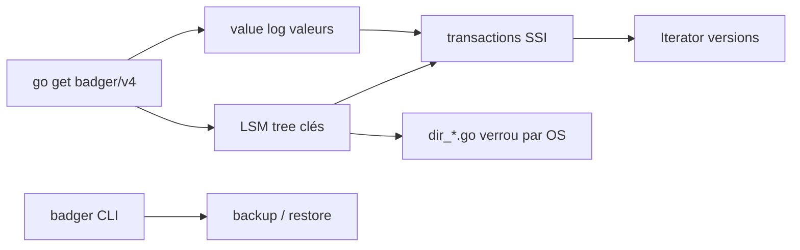

# dgraph-io/badger

> Base clé-valeur embarquée en Go pur, conçue pour les SSD.

## Le problème
Les magasins clé-valeur rapides passent par du C (RocksDB) : cgo, compilation
croisée pénible, et une amplification d'écriture élevée sur SSD.

## Ce que ça fait vraiment
Implémente l'idée du papier WiscKey : séparer les clés des valeurs, avec un arbre
LSM pour les clés et un journal de valeurs à part, ce qui réduit fortement
l'amplification d'écriture par rapport à un LSM classique. Transactions ACID
concurrentes avec isolation par snapshot sérialisable (SSI). Accès trié, snapshots,
TTL, et accès 3D clé-valeur-version : l'API Iterator donne accès aux versions, dont
on règle le nombre conservé par clé via `Options`. Un CLI fournit sauvegarde et
restauration hors ligne.

## Comment c'est branché


## Essayer
```bash
go get github.com/dgraph-io/badger/v4
cd badger
go install .
```

## Coût et pièges
Gratuit, pas de service. Construit avec Go 1.23, volontairement non bumpé pour ne
pas casser les projets en aval. Sur plateformes non POSIX, limites documentées :
AIX ne supporte pas le `fsync` de répertoire (durabilité affectée en cas de crash),
Plan9 et WASM/JS n'ont pas de verrouillage de fichier, Windows utilise un autre
mécanisme.

## Ce que ce n'est pas
Pas une base serveur ni distribuée : elle s'embarque dans un processus Go. Pas de
requêtes, pas d'index secondaires. Le test bancaire de type Jepsen tourne huit
heures chaque nuit chez l'éditeur : c'est un bon signal, pas un audit externe.

## Alternatives
- RocksDB : LSM seul, non Go, transactions non ACID selon la comparaison du README.
- BoltDB : B+ tree, lecture rapide, écriture lente, pas de TTL.
- BadgerHold : couche NoSQL requêtable par-dessus Badger.

## Pour toi
À connaître comme magasin local d'un service Go (cache de features, métadonnées) ;
pas un choix quotidien en Python.
