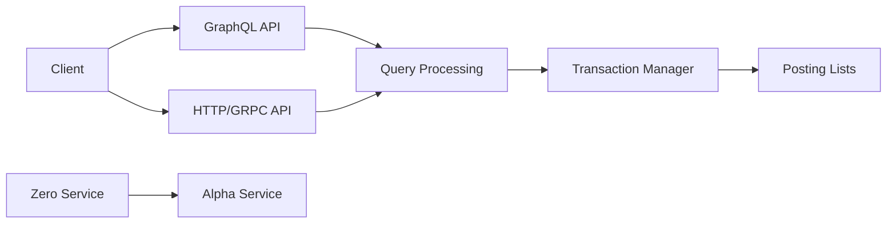

# dgraph-io/dgraph

> Base de données graphe distribuée, native GraphQL, avec transactions ACID et réplication.

## Le problème
Des données très reliées (plus de dix tables jointes par clés étrangères, schémas épars) rendent le SQL lourd et les jointures coûteuses à grande échelle.

## Ce que ça fait vraiment
Stocke un graphe sharde et répliqué ; requêtes en syntaxe GraphQL, réponses JSON ou Protocol Buffers sur gRPC et HTTP.
Deux types de nœuds : Zero (coordination, élection, groupes) et Alpha (données, requêtes), consensus Raft.
Recherche plein texte, regex et géographique natives.
Écrit en Go, version v25.

## Comment c'est branché


## Essayer
```bash
docker pull dgraph/dgraph:latest
docker run -it -p 8080:8080 -p 9080:9080 -v ~/dgraph:/dgraph dgraph/standalone:latest
```

## Coût et pièges
Gratuit sous Apache-2.0. Un cluster réel demande plusieurs nœuds Zero et Alpha à opérer. Compilation depuis les sources : Go 1.27+.

## Ce que ce n'est pas
Pas une base vectorielle ni un outil RAG. Le tableau comparatif avec Neo4j et JanusGraph est rédigé par l'éditeur.

## Alternatives
- Neo4j : Cypher, écosystème riche, mais serveur unique en édition communautaire et GPL v3.
- JanusGraph : Gremlin, s'appuie sur une base distribuée existante.

## Pour toi
À ignorer sauf projet de graphe de connaissances à grande échelle : pour tes usages data courants, le coût d'exploitation d'un cluster distribué ne se justifie pas.
