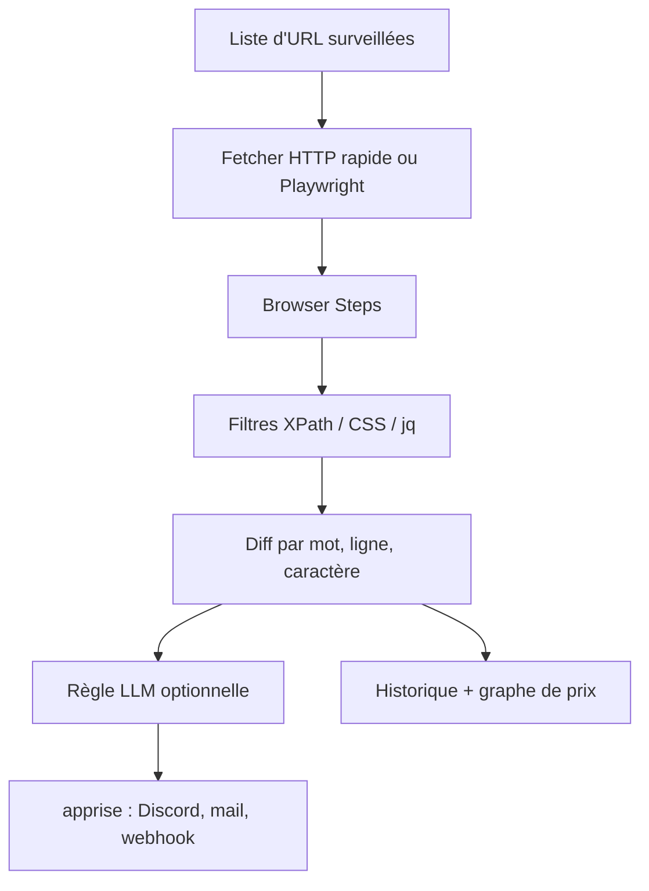

# dgtlmoon/changedetection.io

> Surveillance de pages web auto-hébergée avec notifications, filtres et résumés par LLM.

## Le problème
Beaucoup d'informations n'existent que sur une page web : prix, disponibilité, avis réglementaire, offre d'emploi.
Sans surveillance, on découvre le changement trop tard, ou on relit la page tous les jours à la main.

## Ce que ça fait vraiment
Surveille des URL et notifie par Discord, e-mail, Slack, Telegram, webhook et bien d'autres via apprise ; diff visible par mot, ligne ou caractère.
Ciblage fin : XPath 1 et 2, sélecteurs CSS, JSONPath ou jq, extraction du JSON-LD embarqué dans une page HTML, suivi du texte des PDF, sélecteur visuel avec un fetcher Playwright.
Browser Steps pour se connecter, cliquer, remplir un formulaire avant de mesurer ; détection de réapprovisionnement et de prix avec seuils haut/bas et pourcentage ; planification par fuseau, jour et heure.
Couche LLM optionnelle (via LiteLLM) : règle en langage naturel pour ne notifier que ce qui vous intéresse, et résumé du diff en clair.

## Comment c'est branché


## Essayer
```bash
docker run -d --restart always -p "127.0.0.1:5000:5000" -v datastore-volume:/datastore --name changedetection.io dgtlmoon/changedetection.io
```

```bash
pip3 install changedetection.io
changedetection.io -d /path/to/empty/data/dir -p 5000
```

## Coût et pièges
Auto-hébergement gratuit ; un abonnement hébergé à 8,99 $/mois existe, et le sélecteur visuel suppose un fetcher Playwright.
Les fonctions LLM envoient les diffs et le texte extrait à un fournisseur tiers : le README vous en rend responsable côté CGU des sites, RGPD et facture d'API.

## Ce que ce n'est pas
Ce n'est pas un scraper généraliste : il détecte des changements, il ne construit pas un dataset.
Ce n'est pas exempt de questions juridiques : le README insiste sur votre responsabilité vis-à-vis des CGU et du `robots.txt` des sites surveillés.
Les résumés LLM ne sont pas fiables par construction : le README avertit explicitement sur les hallucinations et les troncatures silencieuses.

## Alternatives
Aucune alternative n'est nommée ; le README se compare à des « services de surveillance » non cités.

## Pour toi
Excellent pour une veille technique automatisée (releases, avis de sécurité, pages réglementaires) sans dépendre d'un SaaS.
