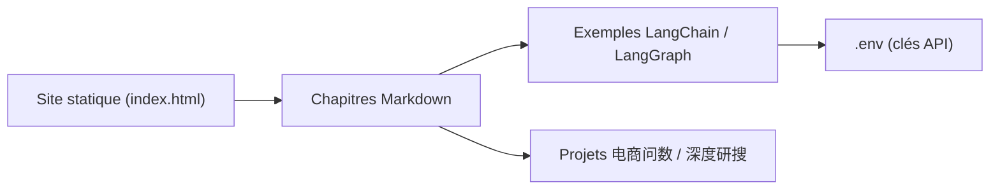

# didilili/ai-agents-from-zero

> Tutoriel en chinois pour apprendre les agents IA en Python : LangChain, LangGraph, RAG, MCP, projets.

## Le problème
Les contenus sur les agents sont éparpillés ; il manque un parcours suivi de la théorie à des projets complets.

## Ce que ça fait vraiment
Dépôt de cours en Markdown (chapitres numérotés, site statique) avec des dossiers d'exemples exécutables (LangChain, LangGraph, Coze/Dify) et deux projets : « 电商问数 » (NL2SQL avec MySQL, Qdrant, Elasticsearch, LangGraph, FastAPI) et « 深度研搜 » (multi-agents DeepAgents). Il couvre aussi le fine-tuning (LoRA, LLaMA-Factory) et une banque de questions d'entretien. Le code complet des deux projets est dans des dépôts externes.

## Comment c'est branché


## Essayer
```bash
git clone https://github.com/didilili/ai-agents-from-zero.git
cd ai-agents-from-zero
python3.10 -m venv .venv
source .venv/bin/activate
pip install -r requirements.txt
python 案例与源码-2-LangChain框架/01-helloworld/StandardDesc.py
```

## Coût et périles
Clés d'API de fournisseurs (Qwen, DeepSeek…) à ta charge, ou Ollama en local. Lancer depuis la racine, sinon `.env` est introuvable.

## Ce que ce n'est pas
Pas une application ni une bibliothèque. Contenu en chinois. Le README dit s'inspirer d'un cours commercial (Shangguigu).

## Alternatives
Aucune alternative nommée dans le README.

## Pour toi
À surveiller : bon parcours structuré si tu lis le chinois et veux monter en compétence sur LangGraph et le RAG, sinon la barrière de langue le rend peu utile.
