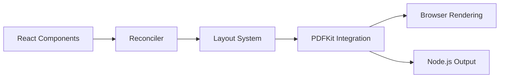

# diegomura/react-pdf

> Bibliothèque pour créer des PDF avec des composants React, dans le navigateur ou sous Node.

## Le problème
Générer des PDF (rapports, factures) impose souvent un moteur séparé et un gabarit sans rapport avec le reste du code React.

## Ce que ça fait vraiment
On écrit des composants `Document`, `Page`, `View`, `Text` avec des styles façon flexbox, puis on les rend : `PDFViewer` dans le DOM, ou `ReactPDF.render` vers un fichier sous Node. D'après le graphe : un réconciliateur React, un moteur de mise en page (Yoga), PDFKit pour l'écriture, gestion de polices et d'images.

## Comment c'est branché


## Essayer
```bash
yarn add @react-pdf/renderer
```
```jsx
import ReactPDF from '@react-pdf/renderer';
ReactPDF.render(<MyDocument />, `${__dirname}/example.pdf`);
```

## Coût et pièges
Gratuit. 327 issues ouvertes. Le README est court : nombreuses fonctions (polices, SVG, images) non détaillées ici.

## Ce que ce n'est pas
Ce n'est pas un lecteur de PDF : le README renvoie vers `react-pdf` pour afficher des PDF existants.

## Alternatives
Aucune alternative nommée dans le README.

## Pour toi
À adopter si tu produis des rapports PDF depuis une appli React ; sinon inutile côté pipeline Python.

