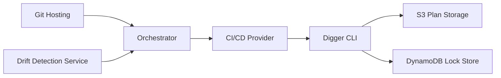

# diggerhq/digger

> Automatisation Terraform dans les pull requests, exécutée par le CI existant plutôt que par un serveur dédié.

## Le problème
Les plateformes Terraform spécialisées doublent le CI, coûtent du calcul et reçoivent tes secrets cloud.

## Ce que ça fait vraiment
Un CLI tourne dans ton CI et appelle Terraform ; un orchestrateur minimal déclenche les jobs sur événements (commentaires de PR). Plan/apply en commentaire de PR, verrous par PR, OPA pour le RBAC, Terragrunt, détection de dérive, persistance des plans. Verrous et cache de plans vont dans ton compte cloud (DynamoDB et S3 sur AWS).

## Comment c'est branché


## Essayer
```bash
atlas migrate apply --url $DATABASE_URL --allow-dirty
```
Cette commande vient de la section migrations ; les guides de démarrage (GitHub Actions + AWS ou GCP) sont dans la documentation.

## Coût et pièges
Télémétrie anonymisée, désactivable via `telemetry: false` ou `TELEMETRY=false`. Le projet est rebaptisé OpenTaco depuis novembre 2025. Environ 490 issues ouvertes.

## Ce que ce n'est pas
Ce n'est pas un outil ML : il concerne l'infrastructure. Ce n'est pas un service à héberger obligatoirement, mais l'orchestrateur est requis.

## Alternatives
- Atlantis : nécessite d'héberger un serveur.
- Terraform Cloud, Spacelift : plateformes tierces qui exécutent le code chez elles.

## Pour toi
À surveiller : pertinent si tu industrialises l'infra de ta plateforme ML en Terraform, sinon hors périmètre.
