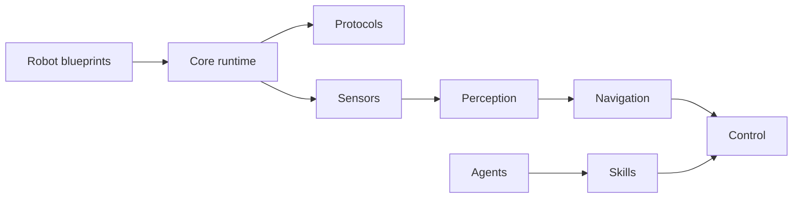

# dimensionalOS/dimos

> Framework Python pour piloter robots quadrupèdes, humanoïdes et drones, avec des agents LLM en outil.

## Le problème
Programmer un robot demande d'assembler capteurs, cartographie, navigation et contrôle, souvent sous ROS.

## Ce que ça fait vraiment
Des modules Python typés (entrées/sorties de flux, RPC) sont câblés en « blueprints » par `autoconnect`, sur des transports LCM, mémoire partagée, DDS, Zenoh ou ROS 2. Le dépôt couvre perception, cartographie, navigation, manipulation, mémoire spatio-temporelle et un serveur MCP pour agents. Simulation MuJoCo et rejeu de sessions disponibles. Statut annoncé : « pre-release beta ».

## Comment c'est branché


## Essayer
```bash
curl -fsSL https://raw.githubusercontent.com/dimensionalOS/dimos/main/scripts/install.sh | bash
dimos --replay run unitree-go2
dimos --simulation run unitree-go2
dimos agent-send "explore the room"
```

## Coût et pièges
Installation par script téléchargé (à lire avant). Le matériel réel est cher ; le rejeu et la simulation évitent le robot. dimTELE (téléopération) passe par un courtier hébergé avec clé d'API. 716 issues ouvertes.

## Ce que ce n'est pas
Pas une solution stable : la table de matériel classe la plupart des robots en beta, alpha ou expérimental. Le « no ROS required » est une promesse du README.

## Alternatives
Aucune alternative nommée dans le README (ROS est cité comme intégration).

## Pour toi
À surveiller : intéressant si tu travailles sur l'IA embarquée ou les agents MCP, mais bêta et licence à clarifier.

