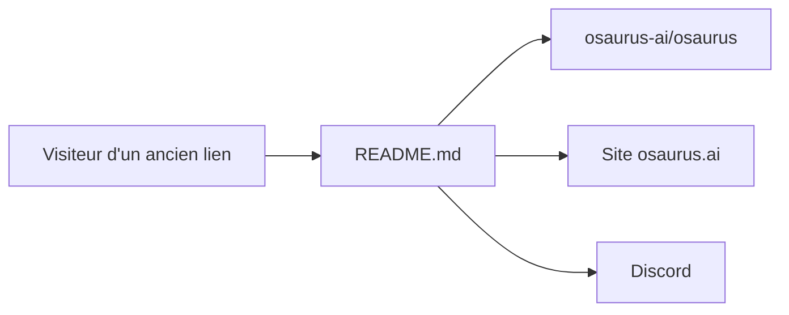

# dinoki-ai/osaurus

> Dépôt-relais : le projet Osaurus a déménagé vers osaurus-ai/osaurus.

## Le problème
Les anciens liens pointent vers un dépôt qui n'est plus le lieu de développement.

## Ce que ça fait vraiment
Le dépôt ne contient qu'un avis de déménagement : une commande pour changer le remote git et des liens vers le site, le nouveau dépôt, Discord et les téléchargements. Nature de l'application Osaurus : non documentée ici.

## Comment c'est branché


## Essayer
```bash
git remote set-url origin https://github.com/osaurus-ai/osaurus.git
```

## Coût et pièges
Rien à installer. Aucune licence déclarée, dernier push le 24 février 2026.

## Ce que ce n'est pas
Pas l'application Osaurus ni son code : uniquement un panneau de redirection.

## Alternatives
osaurus-ai/osaurus : le dépôt actif où vivent développement, issues et versions.

## Pour toi
À ignorer : dépôt vide de contenu ; si Osaurus t'intéresse, évalue le nouveau dépôt.

