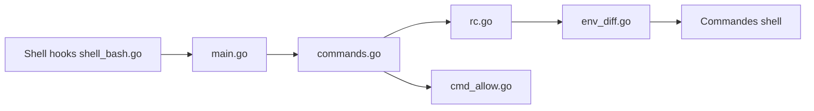

# direnv/direnv

> Extension de shell qui charge et décharge des variables d'environnement selon le dossier courant.

## Le problème
Les variables propres à un projet polluent `.profile` ou doivent être exportées à la main à chaque changement de dossier.

## Ce que ça fait vraiment
Avant chaque invite, direnv cherche `.envrc` (et éventuellement `.env`) dans le dossier et ses parents. S'il est autorisé (`direnv allow`), il l'exécute dans un sous-shell bash, capture les variables exportées, calcule la différence et l'applique au shell courant. Bibliothèque standard (`PATH_add`…), extensions via `direnvrc`. Exécutable statique, nombreux shells pris en charge.

## Comment c'est branché


## Essayer
```bash
mkdir ~/my-project
cd ~/my-project
echo export FOO=foo > .envrc
direnv allow .
brew bundle
make test
```

## Coût et pièges
Gratuit. Unix uniquement ; seul l'environnement est transmis (pas les alias ni les fonctions). 468 issues ouvertes. Le `.envrc` s'exécute avec tes droits : à n'autoriser que si on lui fait confiance.

## Ce que ce n'est pas
Pas un gestionnaire de versions ni de secrets ; il ne charge pas dans le shell courant mais dans un sous-processus.

## Alternatives
mise (direnv + make + asdf), asdf-direnv, quickenv : selon le besoin de vitesse ou d'outils.

## Pour toi
Idéal pour basculer clés d'API et environnements virtuels par projet ; adopte-le.

