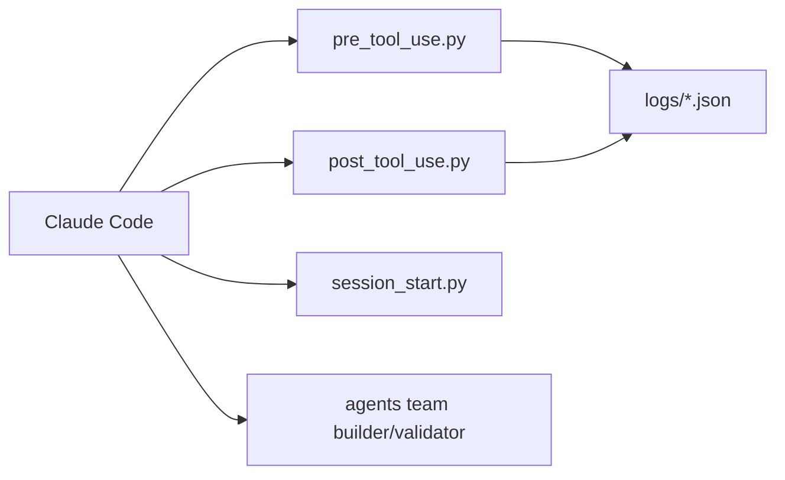

# disler/claude-code-hooks-mastery

> Dépôt pédagogique qui démontre les 13 hooks de Claude Code, les sous-agents et la validation par équipe.

## Le problème
Contrôler le comportement de Claude Code de façon déterministe (bloquer des commandes, journaliser, injecter du contexte) demande de comprendre les hooks.

## Ce que ça fait vraiment
Fournit des scripts Python en fichier unique exécutés par `uv` pour chaque événement (UserPromptSubmit, PreToolUse, PostToolUse, Stop, SessionStart…), qui journalisent en JSON et peuvent bloquer via le code de sortie 2. Ajoute des sous-agents (méta-agent, builder/validator), dix styles de sortie, neuf status lines, des commandes comme `/plan_w_team` et du TTS optionnel (ElevenLabs, OpenAI, Ollama). Les hooks internes n'ont pas été lus dans l'analyse du code.

## Comment c'est branché


## Essayer
```bash
uv run $CLAUDE_PROJECT_DIR/.claude/hooks/user_prompt_submit.py --log-only
cat logs/user_prompt_submit.json | jq '.'
```
Commande de configuration montrée dans `.claude/settings.json`.

## Coût et pièges
Gratuit ; nécessite `uv` et Claude Code. Le TTS et les noms d'agents utilisent des clés tierces facultatives. Le hook Stop qui force la continuation peut boucler. Aucune licence déclarée : réutilisation à clarifier.

## Ce que ce n'est pas
Pas une bibliothèque installable : des exemples à copier et adapter. Le dépôt contient aussi un gestionnaire de tâches Bun sans rapport direct avec les hooks.

## Alternatives
Aucune alternative citée dans le README.

## Pour toi
À surveiller : référence concrète pour tes propres hooks et garde-fous, à lire plutôt qu'à cloner tel quel vu l'absence de licence.

