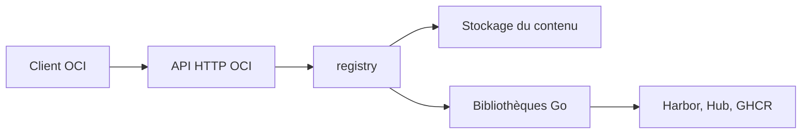

# distribution/distribution

> Implémentation de référence du registre OCI, socle des registres d'images de conteneurs.

## Le problème
Stocker et distribuer des images de conteneurs sans dépendre d'un registre public demande une
implémentation fidèle de la spec OCI Distribution, sûre et capable de tenir la charge.

## Ce que ça fait vraiment
Fournit le binaire `registry`, implémentation de l'OCI Distribution Specification, plus un jeu de
bibliothèques Go pour dialoguer avec ses composants (interfaces déclarées **instables**). Les clients
parlent HTTP selon la spec. Le projet sert de base à Docker Hub, GitHub Container Registry, GitLab
Container Registry, DigitalOcean Container Registry et Harbor (CNCF comme VMware).

## Comment c'est branché

## Essayer
Aucune commande d'installation n'est documentée dans ce README ; la documentation complète est renvoyée
vers https://distribution.github.io/distribution.

## Coût et pièges
Gratuit, mais c'est une brique d'infrastructure : stockage, TLS, authentification et supervision restent
à votre charge. Le client Go inclus est **déprécié** au profit de celui de containerd.

## Ce que ce n'est pas
Pas un produit clés en main avec interface : Harbor joue ce rôle au-dessus.
Pas une API stable côté bibliothèques. Aucune licence indiquée dans ce README.

## Alternatives
- **Harbor** : registre complet (UI, scan, réplication) bâti sur ce socle.
- **containerd** : son implémentation client remplace celle, dépréciée, d'ici.

## Pour toi
Utile à connaître si tu montes un registre privé pour tes images de modèles ; sinon prends Harbor.
