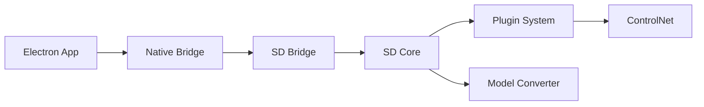

# divamgupta/diffusionbee-stable-diffusion-ui

> Application macOS en un clic pour faire tourner Stable Diffusion localement.

## Le problème
Installer Stable Diffusion en local sur Mac demande Python, dépendances et poids à gérer.

## Ce que ça fait vraiment
Interface Electron, installateur unique, traitement local.
Texte→image, image→image, inpainting, outpainting, upscaling, ControlNet, LoRA ; SD 1.x, 2.x, XL.
Téléchargement de modèles depuis l'app, historique de génération, optimisé M1/M2.

## Comment c'est branché

## Essayer
Aucune commande documentée : téléchargement sur diffusionbee.com.

## Coût et pièges
Gratuit ; macOS 11+ (M1/M2) ou 12.3.1+ (Intel). Sorties soumises à la licence CreativeML OpenRAIL-M.

## Ce que ce n'est pas
Pas une bibliothèque ni une API ; dernier push octobre 2024, modèles récents probablement absents.

## Alternatives
Aucune alternative nommée ; le README cite ses bases (CompVis/stable-diffusion, huggingface/diffusers).

## Pour toi
À ignorer : outil grand public macOS vieillissant, diffusers est la voie pour un usage programmatique.
